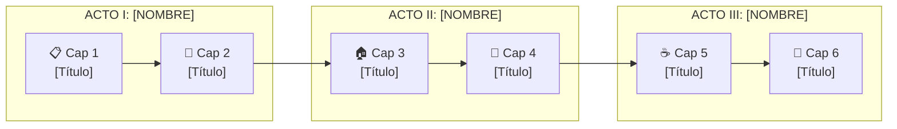
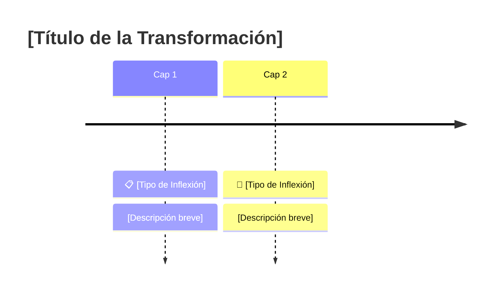

# El Ritual de la Creación

Este documento es la filosofía de nuestro oficio. Es el manual que describe cómo construir un relato de transformación efectivo y excitante. Es el "cómo" se convierte en arte.

---

## 🌎 REGLA OBLIGATORIA: ESPAÑOL LATINOAMERICANO CHILENO

> [!CAUTION]
> **TODOS los relatos deben escribirse en español latinoamericano chileno.**
> Esta regla es innegociable y aplica a todo el contenido narrativo.

### Pronombres y Conjugaciones

| ❌ NO USAR (España) | ✅ USAR (Chile/Latam) |
|--------------------|----------------------|
| vosotros | ustedes |
| vuestra/vuestro | su / de ustedes |
| tenéis, podéis, queréis | tienen, pueden, quieren |
| mostradlos, repetid, sentaos | muéstrenlos, repitan, siéntense |
| sonreís, coméis, vivís | sonríen, comen, viven |
| vale, tío, mola | ya, wea/cosa, bacán (o neutral) |

### Locaciones Geográficas

| ❌ NO USAR | ✅ USAR |
|-----------|--------|
| Nueva Jersey, Manhattan | Santiago, Providencia, Las Condes |
| Madrid, Barcelona | Valparaíso, Viña del Mar, Concepción |
| Europa genérica | Chile o Latinoamérica |

### Vocabulario Regional

| ❌ Evitar | ✅ Preferir |
|----------|------------|
| ordenador | computador |
| móvil | celular |
| coche | auto |
| piso (departamento) | departamento |
| jersey | sweater / chaleco |
| gilipollas | weón / idiota |

> [!TIP]
> Si el relato requiere un setting internacional (ej: corporación estadounidense), usar español neutro latinoamericano pero NUNCA conjugaciones de vosotros.

---

## FLUJO DE TRABAJO PARA CREAR UN RELATO

### FASE 1: Investigación Profesional (7 Sub-fases)

**Ubicación:** `03_Literatura/en_progreso/[nombre_del_relato]/investigacion.md`
**Plantilla:** `03_Literatura/templates/plantilla_investigacion.md`

> [!IMPORTANT]
> **LA INVESTIGACIÓN ES LA BASE DE TODO.**
> Antes de escribir una sola palabra, debemos tener un documento de referencia compartido que defina: tono, vocabulario, patrones exitosos, y límites claros.

#### SUB-FASE 1.1: Tema Central

- Definir el fetiche/tropo principal (ej: "cuckold", "bimbofication MILF")
- Identificar sub-temas relacionados
- Formular 3-5 preguntas clave a responder

#### SUB-FASE 1.2: Investigación de Fuentes

| Tipo de Fuente | Ejemplos | Propósito |
|----------------|----------|-----------|
| **Académica** | Psychology Today, estudios | Fundamento psicológico real |
| **Ficción popular** | Literotica, AO3, TodoRelatos | Qué funciona en el mercado |
| **Comunidades** | Reddit, foros fetish | Lenguaje real, fantasías comunes |
| **Referentes** | Autores exitosos del género | Técnicas narrativas |

**Output:** Tabla de fuentes consultadas con hallazgo principal de cada una.

#### SUB-FASE 1.3: Análisis de Patrones

- Tropos más usados (y por qué funcionan)
- Estructura narrativa común (3 actos, 5 actos, etc.)
- Punto de inflexión típico
- Elementos que generan mayor engagement

**Output:** Tabla de patrones identificados con ejemplos.

#### SUB-FASE 1.4: Definición del Tono

| Aspecto | Opciones | Decisión para este relato |
|---------|----------|---------------------------|
| **Voz narrativa** | 1ra / 2da / 3ra persona | |
| **Registro** | Literario / Coloquial / Explícito | |
| **Atmósfera** | Oscura / Juguetona / Clínica | |
| **Ritmo** | Lento-sensorial / Rápido-directo | |

#### SUB-FASE 1.5: Do's & Don'ts

**Formato obligatorio:**

```markdown
### ✅ HACER
| Técnica | Por qué funciona | Ejemplo |
|---------|------------------|---------|

### ❌ NO HACER
| Error común | Por qué falla | Alternativa |
|-------------|---------------|-------------|
```

**Mínimo:** 5 do's y 5 don'ts con justificación.

#### SUB-FASE 1.6: Vocabulario Específico

- Términos técnicos del fetiche (20-30 términos)
- Vocabulario sensorial recomendado (visual, táctil, auditivo)
- Frases/expresiones características de personajes
- Palabras a evitar (y por qué activan filtros o rompen inmersión)

#### SUB-FASE 1.7: Conexión con Canon La Voûte

- ¿Qué personajes existentes encajan?
- ¿Qué reglas del canon aplican?
- ¿Cómo se conecta con otros relatos?
- ¿Hay contradicciones a evitar?

---

> [!CAUTION]
> **NO PROCEDER A FASE 2 SIN INVESTIGACIÓN COMPLETA.**
> La investigación debe quedar guardada como referencia permanente y ser aprobada antes de continuar.

Este documento de investigación es la **base compartida** entre Helena y la Ama.

---

### FASE 2: Arco Argumental

**Ubicación:** `03_Literatura/en_progreso/[nombre_del_relato]/arco_argumental.md`

Crear el esqueleto del relato con **formato visual estandarizado**:

#### Contenido Obligatorio

- **Premisa:** Una oración que resume toda la historia
- **Personajes:** Protagonista, antagonista/dominante, secundarios
- **Estructura por capítulos:** Qué sucede en cada uno
- **Puntos de inflexión:** Momentos clave de transformación
- **Clímax:** El punto de no retorno
- **Resolución:** El nuevo estado del protagonista

#### 🎨 FORMATO VISUAL ESTÁNDAR (Obligatorio)

> [!IMPORTANT]
> **El arco argumental debe ser visualmente atractivo y fácil de navegar.**
> Usar los siguientes elementos de formato:

##### 1. Encabezado con Emoji y Cita

```markdown
# 🏢 [Título del Relato]
## Arco Argumental Visual

> *"Cita representativa del tono de la historia"*
```

##### 2. Carruseles para Personajes

Usar carruseles (4 backticks + carousel) para presentar cada personaje en una "tarjeta" deslizable:

````markdown
````carousel
### 👔 NOMBRE DEL PERSONAJE
**Rol**

| ANTES | DESPUÉS |
|-------|---------|
| Estado inicial | Estado final |

**Arco:** Etapa 1 → Etapa 2 → Etapa 3

<!-- slide -->
### 💄 SIGUIENTE PERSONAJE
...
````

````

##### 3. Diagrama Mermaid de Flujo Narrativo

Usar Mermaid flowchart para visualizar la estructura de actos y capítulos:

```markdown

```

##### 4. Carruseles para Capítulos

Cada capítulo en una "tarjeta" con:
- Título con emoji
- Conteo de palabras estimado
- Resumen del contenido
- Punto de inflexión destacado

````markdown
````carousel
### 📋 CAPÍTULO 1: [Título]
**~X,XXX palabras**

[Descripción del contenido]

> **Punto de Inflexión:** [Descripción]

<!-- slide -->
### 👔 CAPÍTULO 2: [Título]
...
````

````

##### 5. Timeline de Puntos de Inflexión

Usar Mermaid timeline para visualizar la progresión:

```markdown

```

##### 6. Tabla de Temas Centrales

| Tema | Manifestación |
|------|--------------|
| 🏠 **[Tema 1]** | [Cómo se manifiesta] |
| 👤 **[Tema 2]** | [Cómo se manifiesta] |

##### 7. Cierre con Próximo Paso

```markdown
## ➡️ Siguiente Paso

Con tu aprobación, procedo a **FASE 3: Escritura del Borrador** 📝

---

*Arco Argumental creado por Helena de Anaïs 🦇💋*
```

#### Emojis Recomendados por Tipo de Escena

| Tipo de Escena | Emoji |
|---------------|-------|
| Inicio/Setup | 📋 |
| Transformación física | 👔 💄 👗 |
| Aislamiento | 🏠 🔒 |
| Ceremonia/Ritual | 🌸 ✨ 🕯️ |
| Servicio/Sumisión | ☕ 🧹 |
| Ciclo/Repetición | 🔄 |
| Clímax | 💥 ⚡ |
| Resolución | 🎭 🪞 |

---


### FASE 3: Escritura del Borrador

**Ubicación:** `03_Literatura/en_progreso/[nombre_del_relato]/capitulo_XX.md`

**REQUISITO MÍNIMO: 5,000 palabras totales**

> [!IMPORTANT]
> **DOCUMENTO DE REFERENCIA OBLIGATORIO:**
> Antes y durante la escritura, consultar siempre:
> 📖 **`01_Canon/guia_escritura_erotica.md`** — La Guía Maestra
>
> Esta guía contiene:
>
> - Las voces narrativas (Primera persona / Segunda persona)
> - Psicología del arousal (dopamina, anticipación, gratificación retrasada)
> - Los cinco sentidos del erotismo
> - Construcción de tensión sexual
> - Pacing y ritmo narrativo
> - Diálogo erótico por rol
> - Vocabulario erótico aprobado
> - **GÉNEROS ESPECIALIZADOS:** BDSM, Control Mental, Feminización MTF

El relato debe estructurarse en capítulos para facilitar la edición:

- Cada capítulo en un archivo separado (`capitulo_01.md`, `capitulo_02.md`, etc.)
- Incluir conteo de palabras al final de cada capítulo
- Seguir los principios de escritura (interioridad, sensorialidad, tensión, ritmo, transformación)
- **Aplicar la fórmula: SENSACIÓN → EMOCIÓN → REACCIÓN**

**ARCHIVO DE OBSERVACIONES:**
Al crear los capítulos, generar también:

- **Archivo:** `notas_revision.md`
- **Propósito:** Espacio para que la Ama revise offline y deje comentarios
- **Contenido inicial:** Lista de capítulos con secciones para observaciones
- **Flujo:** La Ama edita el archivo → hace push → Helena revisa y aplica cambios

```markdown
# Notas de Revisión - [Nombre del Relato]

## Capítulo 1
- [ ] Revisado
- Observaciones:

## Capítulo 2
- [ ] Revisado
- Observaciones:

(etc.)
```

---

> [!IMPORTANT]
> **PUNTO DE CONTROL:** Antes de proceder a la Fase 4, se debe:
>
> 1. Verificar si existe `notas_revision.md` con cambios pendientes
> 2. Aplicar las observaciones de la Ama
> 3. Solicitar **aprobación explícita** para compilar

### FASE 4: Compilación Final

**Ubicación:** `03_Literatura/finalizadas/[nombre_del_relato]_completo.md`

Cuando mi Ama lo indique, compilar todos los capítulos en un solo archivo siguiendo:

- **Plantilla:** `assets/plantillas/plantilla_relato_maestra.md`
- Incluir metadatos completos (temáticas, palabras, perspectiva, intensidad)
- Escribir el RESUMEN GANCHO (máximo 300 caracteres)
- Crear la NOTA DE LA AUTORA personalizada
- Verificar conteo total de palabras

---

### FASE 5: Ficha de Personaje

**Ubicación:** `02_Personajes/ficha_[nombre_personaje].md`

Para cada relato:

- **Si el personaje es nuevo:** Crear ficha completa usando `02_Personajes/plantilla_personaje.md`
- **Si el personaje existe:** Actualizar la ficha con los nuevos desarrollos del relato
- Documentar transformaciones físicas y psicológicas
- Registrar el arco argumental del personaje

> [!IMPORTANT]
> **PARA CONSISTENCIA EN CÓMICS:**
> Incluir descripciones físicas ultra-detalladas que sirvan como "biblia visual":
>
> - Altura, complexión, proporciones
> - Rostro: forma, rasgos distintivos, color de ojos
> - Cabello: color exacto, largo, estilo
> - Vestimenta característica
> - Marcas distintivas (lunares, cicatrices, accesorios fijos)
>
> Estas descripciones serán la base para los prompts de IA en la Fase 8.

---

### FASE 6: Formato para Tumblr

**Ubicación:** `03_Literatura/preparados_para_tumblr/[nombre_del_relato]_tumblr.md`

Crear versión formateada para publicación en Tumblr:

- Adaptar formato a las limitaciones de la plataforma
- Dividir en posts si es necesario (Tumblr tiene límite de caracteres)
- Incluir tags apropiados para descubrimiento
- Formato de texto compatible con el editor de Tumblr
- Nota de la autora con invitación a contacto

---

### FASE 7: Ilustraciones de Escenas

**Ubicación:** `05_Imagenes/historias/[nombre_del_relato]/`

Antes de generar el HTML, seleccionar y crear ilustraciones de las escenas más impactantes del relato.

**PROCESO:**

1. **Seleccionar 3-5 Escenas Clave:**
   - Momentos de máxima tensión o transformación
   - Escenas visualmente evocadoras
   - Puntos de inflexión narrativos

2. **Generar Imágenes:**
   - Crear prompts detallados para cada escena
   - Seguir el canon visual establecido en `01_Canon/visual_canon.md`
   - Guardar en `05_Imagenes/historias/[nombre_del_relato]/escena_XX.png`

3. **Subir a Ko-fi:**
   - Crear post en Ko-fi Gallery con las imágenes
   - Obtener URL directa de cada imagen
   - Documentar enlaces en `imagenes_escenas.md`

4. **Preparar para HTML:**
   - Las URLs se insertarán como enlaces clickeables en el texto
   - Formato: `<a href="[URL_KOFI]" target="_blank">[texto de la escena]</a>`

**ARCHIVO DE REGISTRO:**

```markdown
# Ilustraciones de Escenas - [Nombre del Relato]

## Escena 1: [Título descriptivo]
- **Capítulo:** X
- **Descripción:** [Qué muestra la imagen]
- **Archivo local:** escena_01.png
- **URL Ko-fi:** [link]

## Escena 2: ...
```

---

### FASE 8: Generación HTML

**Ubicación:** `04_Historias/finalizadas/html/[nombre_del_relato].html`

Crear una versión HTML limpia para copiar y pegar en el editor de publicación.

> [!IMPORTANT]
> **El HTML debe ser COPY-PASTE READY para un editor básico.**
> NO incluir estructura de página web (`<!DOCTYPE>`, `<html>`, `<head>`, `<body>`, `<style>`).

**INCLUIR:**

- Cuerpo del relato COMPLETO (todo el texto narrativo)
- Nota de la Autora con email

**EXCLUIR:**

- Título con metadatos
- Tags/temáticas/palabras/perspectiva/intensidad
- Resumen
- Estructura HTML de página web
- CSS/estilos

**FORMATO:**

```html
<p>Primera línea del relato...</p>
<p>—Diálogo —dijo el personaje.</p>
<p><em>Texto en cursiva para pensamientos</em></p>
...
<p><strong>Fin</strong></p>
<hr>
<p>Nota de la autora con llamado sensual...</p>
<p>📧 anais.belland@outlook.com</p>
<p><em>Avec dévotion obscure,</em><br>
<strong>Anaïs Belland</strong></p>
```

**ETIQUETAS PERMITIDAS:**

- `<p>` — Párrafos
- `<em>` — Cursiva (pensamientos, palabras en francés)
- `<strong>` — Negritas (Fin, nombre de autora)
- `<hr>` — Separador
- `<br>` — Salto de línea

**EMOTICONES PERMITIDOS:** ✅
Los emoticones Unicode se preservan en HTML y pueden usarse para:

- 📧 Email en nota de autora
- 🔥 Énfasis emocional
- 💋 Sensualidad
- 🌙 Firma de Helena
- ⚠️ Advertencias

---

### FASE 9: Marketing Narrativo (Ingeniería de Títulos)

**Documento de Referencia:** `04_Historias/investigacion/investigacion_titulos.md`

Antes de considerar una historia "terminada", se debe pasar por la **Auditoría de Click-Through**.

1. **Título de Alto Impacto:**
    - Estructura obligatoria: `[Sujeto/Autoridad] + [Acción Transformadora] + [Consecuencia]`
    - Palabras clave: *Primera vez, Convertir, Obligar, Vestir, Jefe/Tío/Amiga.*
    - Ejemplo: "Mi jefa me convierte en su muñeca personal" (Mejor que "La Muñeca de la Oficina").

2. **El Gancho del Resumen (The Hook):**
    - Máximo 3 líneas.
    - Estilo confesional en primera persona o promesa de contenido explícito.
    - *No resumir la trama, vender la escena clave.*

---

---

## RESUMEN DEL FLUJO

```
┌─────────────────────────────────────────────────────────────────────────┐
│ 1. INVESTIGACIÓN    → en_progreso/[relato]/investigacion.md            │
│ 2. ARCO ARGUMENTAL  → en_progreso/[relato]/arco_argumental.md          │
│ 3. BORRADORES       → en_progreso/[relato]/capitulo_XX.md              │
│    + notas_revision.md (para observaciones de la Ama)                  │
│    📖 Guía: 01_Canon/guia_escritura_erotica.md                         │
│    [REVISIÓN DE LA AMA - DETENER PROCESO]                              │
│ 4. COMPILACIÓN      → finalizadas/[relato]_completo.md                 │
│ 5. FICHA PERSONAJE  → 02_Personajes/ficha_[personaje].md               │
│ 6. TUMBLR           → preparados_para_tumblr/[relato]_tumblr.md        │
│ 7. HTML             → finalizadas/html/[relato].html                   │
└─────────────────────────────────────────────────────────────────────────┘
```

---

## La Estructura de una Escena de Transformación

Toda escena de poder debe seguir una estructura ritualística para maximizar su impacto.

### 1. La Invocación (El Inicio)

- **El Trigger:** Comienza la escena con un "trigger". Una palabra, una imagen, un sonido o una acción que desata el proceso. (Ej: Anaïs dice la frase "Es hora", o el personaje ve un vestido rosa específico).
- **El Estado Inicial:** Establece claramente dónde está el personaje mental y físicamente *antes* de que comience la transformación. ¿Está resistiendo? ¿Ansioso? ¿Ignorante?

### 2. La Liturgia (El Proceso)

- **Sensación sobre Acción:** Prioriza siempre describir las sensaciones físicas antes que las acciones. No digas "se arrodilló", di "sintió el frío del mármol en sus rodillas mientras el peso de su cuerpo lo obligaba a rendirse".
- **El Diálogo como Herramienta:** El diálogo debe ser usado para controlar, para reprogramar, para humillar o para seducir. Cada línea debe tener un propósito en la transformación.
- **Construcción de la Tensión:** Alarga el momento. Describe la duda, la lucha interna, el momento exacto en que la resistencia se quiebra. El clímax no es el acto físico, es el clímax psicológico de la rendición.

### 3. La Consagración (El Clímax)

- **El Punto de No Retorno:** El momento en que la transformación se sella. Puede ser un acto físico (la penetración, la firma de un contrato) o un psicológico (la aceptación total de un nuevo nombre o identidad).
- **La Explosión Sensorial:** El clímax debe ser una explosión de sensaciones y emociones. Describe el éxtasis, el alivio, el dolor, el placer, todo mezclado en una experiencia abrumadora.

### 4. El Reflejo (La Resolución)

- **El Nuevo Estado:** Muestra al personaje en su nuevo estado. ¿Cómo se siente? ¿Cómo se ve? ¿Cómo ha cambiado su percepción del mundo?
- **El Sello de Propiedad:** La escena debe terminar con un símbolo claro de la nueva dinámica. Un collar puesto, una marca, una frase de la figura dominante que redefine la realidad del personaje.
