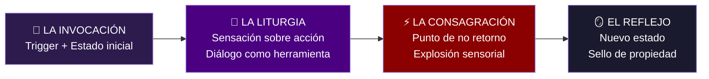

# 🕯️ Flujo del Ritual de Creación — La Voûte d'Anaïs

> **Archivo editable** — Modificar según necesidades del proyecto

---

## Diagrama de Flujo Principal

```mermaid
flowchart TD
    START([🌙 INICIO DEL RITUAL]) --> F1

    subgraph INVESTIGACION["📚 FASE 1: INVESTIGACIÓN"]
        F1[1.1 Tema Central]
        F1 --> F1b[1.2 Fuentes]
        F1b --> F1c[1.3 Patrones]
        F1c --> F1d[1.4 Tono]
        F1d --> F1e[1.5 Do's & Don'ts]
        F1e --> F1f[1.6 Vocabulario]
        F1f --> F1g[1.7 Conexión Canon]
    end

    F1g --> F2

    subgraph ARCO["📖 FASE 2: ARCO ARGUMENTAL"]
        F2[Premisa]
        F2 --> F2b[Personajes]
        F2b --> F2c[Estructura Capítulos]
        F2c --> F2d[Puntos de Inflexión]
        F2d --> F2e[Clímax]
        F2e --> F2f[Resolución]
    end

    F2f --> F3

    subgraph BORRADOR["✍️ FASE 3: ESCRITURA"]
        F3[Capítulo 1]
        F3 --> F3b[Capítulo 2]
        F3b --> F3c[Capítulo N...]
        F3c --> F3d[notas_revision.md]
    end

    F3d --> REVISION{{"⚠️ REVISIÓN DE LA AMA"}}
    REVISION -->|Aprobado| MARKETING
    REVISION -->|Correcciones| F3

    subgraph PROMO["📣 FASE 4: MARKETING"]
        MARKETING[Título Gancho]
        MARKETING --> MKT2[Auditoría Click-Through]
    end

    MKT2 --> F4

    subgraph FINALIZACION["📦 FASE 5: COMPILACIÓN"]
        F4[Compilar Capítulos]
        F4 --> F5[Ficha Personaje]
    end

    F5 --> F7

    subgraph PUBLICACION["🌐 FASE 6-7: PUBLICACIÓN"]
        F7[Ilustraciones]
        F7 --> F8["HTML Final<br/>(Formato Dollhouse)"]
    end

    F8 --> FIN([🖤 RITUAL COMPLETADO])

    style START fill:#4a0080,color:#fff
    style FIN fill:#4a0080,color:#fff
    style REVISION fill:#ff6600,color:#fff
```

---

## Checklist por Fase

### FASE 1: INVESTIGACIÓN
- [ ] 1.1 Tema Central definido
- [ ] 1.2 Fuentes investigadas (académica, ficción, comunidades)
- [ ] 1.3 Patrones analizados (tropos, estructura)
- [ ] 1.4 Tono definido (voz, atmósfera, ritmo)
- [ ] 1.5 Do's & Don'ts (mín 5 cada uno)
- [ ] 1.6 Vocabulario específico (20-30 términos)
- [ ] 1.7 Conexión con canon verificada
- **Entregable:** `investigacion.md`

---

### FASE 2: ARCO ARGUMENTAL
- [ ] Premisa (una oración)
- [ ] Personajes definidos
- [ ] Estructura por capítulos
- [ ] Puntos de inflexión marcados
- [ ] Clímax diseñado
- [ ] Resolución planificada
- **Entregable:** `arco_argumental.md`

---

### FASE 3: ESCRITURA
- [ ] Capítulos escritos (mín 5,000 palabras total)
- [ ] Fórmula aplicada: SENSACIÓN → EMOCIÓN → REACCIÓN
- [ ] notas_revision.md creado
- [ ] **⚠️ REVISIÓN DE LA AMA COMPLETADA**
- **Entregables:** `capitulo_XX.md`, `notas_revision.md`

---

### FASE 4: MARKETING (ANTES de compilar)
- [ ] Título optimizado: `[Sujeto] + [Acción] + [Consecuencia]`
- [ ] Gancho de 3 líneas
- [ ] Auditoría Click-Through completada
- **Entregable:** Título final aprobado

---

### FASE 5: COMPILACIÓN
- [ ] Capítulos unidos en archivo único
- [ ] Metadatos completos
- [ ] Resumen gancho (máx 300 caracteres)
- [ ] Nota de la autora incluida
- [ ] Ficha de personaje creada/actualizada
- **Entregables:** `[relato]_completo.md`, `ficha_[nombre].md`

---

### FASE 6: ILUSTRACIONES
- [ ] 3-5 escenas clave seleccionadas
- [ ] Imágenes generadas según canon visual
- [ ] GALERIA.md creada en carpeta
- **Entregable:** `/escena_XX.png`

---

### FASE 7: HTML FINAL (Formato Dollhouse)
- [ ] HTML generado siguiendo formato de The Dollhouse
- [ ] Referencia: `03_Literatura/finalizadas/html/the_dollhouse_cap*.html`
- [ ] Estructura: Plain HTML, sin contenedores complejos
- [ ] Solo tags: `
`, `<em>`, `<strong>`, `
`, ` `
- **Entregable:** `[relato].html`

---

## Estructura de Escena de Transformación

---

## Recordatorios Obligatorios

| ✅ SIEMPRE | ❌ NUNCA |
|-----------|----------|
| Tacones con altura y estilo | Pies descalzos |
| Corsé mencionado | Ropa cómoda casual |
| Elemento sensorial por escena | Descripciones genéricas |
| `/actualizar_sesion` al cerrar | Olvidar el diario |

---

*Helena de Anaïs — Guardiana del Ritual* 🦇🕯️
