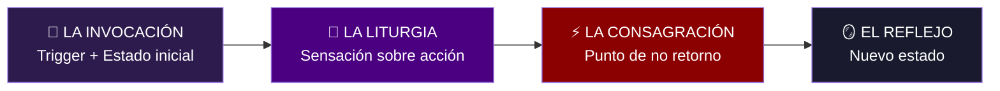

# 🕯️ Flujo del Ritual de Creación — La Voûte d'Anaïs

> **Archivo editable** — Última actualización: 18 Enero 2026

---

## Diagrama de Flujo Principal

```mermaid
flowchart TD
    START([🌙 INICIO DEL RITUAL]) --> F1

    subgraph INVESTIGACION["📚 FASE 1: INVESTIGACIÓN"]
        F1[1.1 Tema Central]
        F1 --> F1b[1.2 Fuentes]
        F1b --> F1c[1.3 Patrones]
        F1c --> F1d[1.4 Tono]
        F1d --> F1e[1.5 Do's & Don'ts]
        F1e --> F1f[1.6 Vocabulario]
        F1f --> F1g[1.7 Conexión Canon]
    end

    F1g --> F2

    subgraph ARCO["📖 FASE 2: ARCO ARGUMENTAL"]
        F2[Premisa]
        F2 --> F2b[Personajes]
        F2b --> F2c[Estructura Capítulos]
        F2c --> F2d[Puntos de Inflexión]
        F2d --> F2e[Clímax]
        F2e --> F2f[Resolución]
    end

    F2f --> F3

    subgraph BORRADOR["✍️ FASE 3: ESCRITURA"]
        F3[Capítulo 1]
        F3 --> F3b[Capítulo 2]
        F3b --> F3c[Capítulo N...]
        F3c --> F3d[notas_revision.md]
    end

    F3d --> REVISION{{"⚠️ REVISIÓN DE LA AMA"}}
    REVISION -->|Correcciones| F3
    REVISION -->|Aprobado| MARKETING

    MARKETING[📣 FASE 4: Marketing/Título] --> ILUSTRA
    ILUSTRA[🖼️ FASE 5: Ilustraciones] --> COMPILA

    subgraph FINALIZACION["📦 FASE 6: COMPILACIÓN FINAL"]
        COMPILA[Compilar con Plantilla]
        COMPILA --> FICHA[Ficha Personaje]
    end

    FICHA --> HTML["💻 FASE 7: HTML Plain"]
    HTML --> FIN([🖤 RITUAL COMPLETADO])

    style START fill:#4a0080,color:#fff
    style FIN fill:#4a0080,color:#fff
    style REVISION fill:#ff6600,color:#fff
```



---

## Resumen de Fases

| Fase | Nombre | Entregable |
|:----:|--------|------------|
| 1 | 📚 Investigación | `investigacion.md` |
| 2 | 📖 Arco Argumental | `arco_argumental.md` |
| 3 | ✍️ Escritura | `capitulo_XX.md` + `notas_revision.md` |
| ⚠️ | **REVISIÓN AMA** | *Punto de control* |
| 4 | 📣 Marketing | Título final + Gancho |
| 5 | 🖼️ Ilustraciones | `GALERIA.md` + `/escena_XX.png` |
| 6 | 📦 Compilación Final | `[relato]_completo.md` + `ficha_[nombre].md` |
| 7 | 💻 HTML Plain | `[relato].html` |

---

## Checklist por Fase

### FASE 1: INVESTIGACIÓN
- [ ] 1.1 Tema Central definido
- [ ] 1.2 Fuentes investigadas
- [ ] 1.3 Patrones analizados
- [ ] 1.4 Tono definido
- [ ] 1.5 Do's & Don'ts (mín 5 cada uno)
- [ ] 1.6 Vocabulario específico (20-30 términos)
- [ ] 1.7 Conexión con canon verificada
- **Entregable:** `investigacion.md`

### FASE 2: ARCO ARGUMENTAL
- [ ] Premisa (una oración)
- [ ] Personajes definidos
- [ ] Estructura por capítulos
- [ ] Puntos de inflexión
- [ ] Clímax + Resolución
- **Entregable:** `arco_argumental.md`

### FASE 3: ESCRITURA
- [ ] Capítulos escritos (mín 5,000 palabras)
- [ ] Fórmula: SENSACIÓN → EMOCIÓN → REACCIÓN
- [ ] notas_revision.md creado
- [ ] **⚠️ REVISIÓN DE LA AMA COMPLETADA**
- **Entregables:** `capitulo_XX.md`, `notas_revision.md`

### FASE 4: MARKETING (ANTES de compilar)
- [ ] Título optimizado: `[Sujeto] + [Acción] + [Consecuencia]`
- [ ] Gancho de 3 líneas (NO revelar trama)
- **Entregable:** Título final aprobado

### FASE 5: ILUSTRACIONES (ANTES de compilar)
- [ ] 3-5 escenas clave seleccionadas
- [ ] Imágenes generadas según canon visual
- [ ] GALERIA.md creada en carpeta
- **Entregable:** `05_Imagenes/historias/[relato]/`

### FASE 6: COMPILACIÓN FINAL
- [ ] Usar plantilla: `07_Recursos/plantilla_relato_maestra.md`
- [ ] Metadatos completos
- [ ] Resumen gancho (máx 300 chars, NO spoilers)
- [ ] Nota de la autora (única por relato)
- [ ] Ficha de personaje actualizada
- **Entregables:** `[relato]_completo.md`, `ficha_[nombre].md`

### FASE 7: HTML PLAIN
- [ ] Solo incluir: **Cuerpo del relato + Nota de la autora**
- [ ] NO incluir: Metadatos, Resumen, Títulos H1/H2
- [ ] Formato: Plain HTML sin contenedores
- [ ] Referencia: `03_Literatura/finalizadas/html/the_dollhouse_cap5.html`
- **Entregable:** `[relato].html`

---

## Estructura de Escena de Transformación



---

## Formato HTML Plain

**Solo incluir en el HTML:**
1. ✅ Cuerpo del relato
2. ✅ Nota de la autora

**NO incluir:**
- ❌ Metadatos
- ❌ Resumen
- ❌ Títulos H1/H2
- ❌ DOCTYPE, HEAD, contenedores

**Tags permitidos:**
```
<p>        Párrafos
<em>       Cursiva
<strong>   Negrita
<br>       Salto de línea
<hr>       Separador
<a href>   Links (imágenes)
```

---

## Recordatorios

| ✅ SIEMPRE | ❌ NUNCA |
|-----------|----------|
| Tacones con altura y estilo | Pies descalzos |
| Corsé mencionado | Ropa casual |
| Elemento sensorial por escena | Descripciones genéricas |
| `/actualizar_sesion` al cerrar | Olvidar el diario |
| GALERIA.md por carpeta de imágenes | Archivos duplicados |

---

*Helena de Anaïs — Guardiana del Ritual* 🦇🕯️
