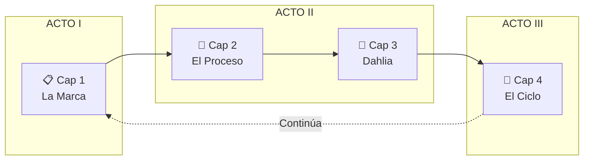
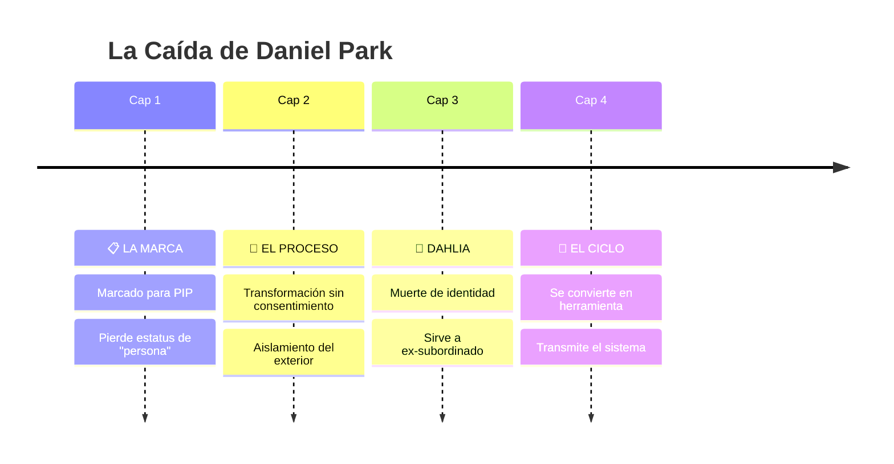

# 🏢 HR: Human Repurposing

## Arco Argumental Visual

> *"La Familia nunca te abandonaría. Por eso te estamos ayudando a encontrar tu verdadero lugar."*

---

## 📋 METADATOS

| Campo | Valor |
|-------|-------|
| **Título** | HR: Human Repurposing |
| **Género** | Distopía Corporativa + Forced Feminization |
| **Estética** | Mad Men Retrofuturista |
| **Perspectiva** | Tercera persona limitada |
| **Capítulos** | 4 |
| **Palabras** | ~6,000 (1,500 por capítulo) |
| **Intensidad** | 🔥🔥🔥🔥 |

---

## 📍 LA PREMISA

> Un analista de datos leal a su empresa descubre demasiado tarde que el **"Performance Improvement Plan"** es el proceso de convertirlo en una secretaria decorativa para la misma oficina donde antes era jefe.

---

## 🎭 PERSONAJES

### 👔 Daniel Park → "Dahlia" (Protagonista)

| ANTES | DESPUÉS |
|-------|---------|
| Analista Senior, 34 años | Asistente Decorativa |
| Traje gris, corbata | Vestido rosa coral, tacones 6" |
| "La Familia cuida de los suyos" | "¿Cómo puedo ayudarle?" |

**Arco:** Fe ciega → Confusión → Quiebre → Transmisión del ciclo

### 💄 Miranda Vance (VP de HR)

- **Referencia visual:** Joan Holloway (Mad Men) — pelirroja voluptuosa, curvas peligrosas
- Maternal, dulce, aterradora
- Genuinamente cree que "ayuda"
- *"No te preocupes, cariño. La Familia sabe lo que es mejor."*

### 📈 Marcus Webb (Ex-subordinado → Nuevo jefe)

- Daniel lo ayudó a subir
- Marcus lo marcó para el PIP
- Simboliza la inversión de poder

---

## 📊 ESTRUCTURA: 4 CAPÍTULOS

---

## 📖 CAPÍTULOS

### 📋 CAPÍTULO 1: "La Marca"

**~1,500 palabras**

**Contenido:**

- Establecer el mundo Mad Men retrofuturista de NEXUM Corp
- Daniel recibe el email: "Oportunidad de Mejora Iniciada"
- Reunión con Miranda Vance — voz dulce, palabras de familia
- Sus compañeros empiezan a evitar mirarlo
- Primera señal de alarma: su foto en HR tiene un marco rosa

**Punto de Inflexión:** El sistema lo ha marcado. Ya no es persona, es proceso.

---

### 👗 CAPÍTULO 2: "El Proceso"

**~1,500 palabras**

**Contenido:**

- Cursos de "presencia profesional" — caminar, sonreír, voz
- Uniforme obligatorio: camisa rosa, tacones bajos
- Mudanza al dormitorio corporativo — sin acceso al exterior
- Conoce a Crystal (3 años en Decoración) quien le dice: "Vas a estar bien"
- Tratamientos "de bienestar": nota cambios en su cuerpo que no pidió

**Punto de Inflexión:** La transformación ha comenzado sin consentimiento. Está atrapado.

---

### 🌸 CAPÍTULO 3: "Dahlia"

**~1,500 palabras — CLÍMAX**

**Contenido:**

- La Ceremonia de Naming: sala retrofuturista, todas las Decoraciones presentes
- Miranda le asigna su nuevo nombre: **"Dahlia"**. Placa grabada. Aplausos.
- Primer día de trabajo: uniforme rosa completo, tacones de 6"
- Llevado al Piso 47 — su antigua oficina
- **El Momento:** Marcus (su ex-subordinado) lo llama: *"Dahlia, tráeme un café."*
- Le mira a los ojos. Sonríe. Dahlia sonríe de vuelta. Esta vez es genuino.

**Punto de Inflexión:** La identidad antigua muere. Encuentra paz en servir.

---

### 🔄 CAPÍTULO 4: "El Ciclo"

**~1,500 palabras — RESOLUCIÓN**

**Contenido:**

- Un año después. Dahlia es la mejor asistente del Piso 47.
- Un día típico: rutina de belleza, servir café, sonreír, ser útil
- Un nuevo analista, Kevin, es marcado para PIP. Dahlia reconoce el miedo en sus ojos.
- Miranda le pide que "lo guíe" en la transición
- Dahlia se acerca a Kevin y dice las palabras exactas:
  > *"No te preocupes. La Familia nunca abandona a los suyos."*
- Kevin llora. Dahlia le toma la mano con gentileza.

**Resolución:** El ciclo continúa. La víctima transmite el sistema.

**Última línea:**
> *La música bossa nova fluye por los altavoces. Dahlia tararea. Es un buen día en NEXUM Corp.*

---

## 🎯 PUNTOS DE INFLEXIÓN

---

## 💎 TEMAS CENTRALES

| Tema | Manifestación |
|------|--------------|
| 🏠 **Familia como Trampa** | Amor para control absoluto |
| 👤 **Cuerpo como Propiedad** | Empleados son activos |
| 🔄 **Complicidad Víctima** | El ciclo requiere participación |
| 😊 **Paz de Rendición** | El horror: Dahlia es feliz |

---

## ➡️ SIGUIENTE PASO

Con tu aprobación, procedo a **FASE 3: Escritura del Borrador** 📝

---

*Arco creado por Helena de Anaïs 🦇💋*
