# 📺 THE DOLLHOUSE — Documento Maestro de Producción

> **Estado Actual:** Capítulo 4 completado, votación activa para Cap 5
> **Última Actualización:** 05 Enero 2026
> **Tipo de Proyecto:** Reality Show Interactivo de Bimboficación MTF

---

## 1. ESTRUCTURA DEL PROYECTO

### 1.1 Ubicación de Archivos

```
📁 LaVouteDAnais/
├── 04_Historias/
│   ├── en_progreso/reality_show/          ← FUENTE PRINCIPAL
│   │   ├── capitulo_01.md                  (10.7 KB - Ingreso + Inyección Glow)
│   │   ├── capitulo_02.md                  (11.7 KB - Quiz Bloque 1 + Votación)
│   │   ├── capitulo_03.md                  (30.1 KB - Transformación Marco + Quiz Bloque 2)
│   │   ├── notas.md                        (Mecánicas, perfiles, preguntas)
│   │   ├── pool_castigos.md                (Catálogo de transformaciones)
│   │   └── formato_html.md                 (Especificaciones de publicación)
│   │
│   └── finalizadas/html/                  ← PUBLICACIÓN
│       ├── the_dollhouse_caps1-2.html      (Caps 1-2 juntos)
│       ├── the_dollhouse_cap3_simple.html  (Cap 3 - versión para blog)
│       ├── the_dollhouse_cap3.html         (Cap 3 - versión completa)
│       └── the_dollhouse_cap3_embed.html   (Cap 3 - inline styles)
│
└── 05_Imagenes/the_dollhouse/             ← ASSETS VISUALES
    ├── galeria_dollhouse.md                (Índice de imágenes)
    ├── dollhouse_marco_before_*.png
    ├── dollhouse_marco_porcelain_*.png
    ├── dollhouse_julian_giggle_*.png
    └── dollhouse_stage_set_*.png
```

### 1.2 Separación del Flujo Principal

The Dollhouse es un **proyecto independiente** del flujo típico de relatos de La Voûte:

| Aspecto | Relatos Tradicionales | The Dollhouse |
|---------|----------------------|---------------|
| Formato | Historia completa | Serializado por capítulos |
| Interactividad | Ninguna | Votaciones del público |
| Publicación | Una vez | Episódica (1 cap/semana) |
| HTML | Opcional | Obligatorio para votación |
| Continuidad | Auto-contenida | Depende de votaciones previas |

---

## 2. MECÁNICAS DEL CONCURSO

### 2.1 Estructura General

```
TEMPORADA 1
├── Participantes: 2 (Julián "El Príncipe" + Marco "El Toro")
├── Objetivo: Uno sale libre, otro sale bimbo
├── Mecánica: Quiz por bloques con castigos acumulativos
└── Duración: ~10 capítulos estimados
```

### 2.2 Flujo de Cada Capítulo

```mermaid
flowchart TD
    A[Inicio Capítulo] --> B[Aplicar castigo votado del cap anterior]
    B --> C[Quiz: 3 preguntas]
    C --> D{¿Error?}
    D -->|Sí| E[-5 IQ + Castigo del Bloque]
    D -->|No| F[+1 Punto]
    E --> G[Siguiente pregunta]
    F --> G
    G --> H{¿3 preguntas?}
    H -->|No| C
    H -->|Sí| I[Determinar perdedor del bloque]
    I --> J[Presentar 2 opciones de castigo]
    J --> K[CORTE COMERCIAL + VOTACIÓN]
    K --> L[FIN CAPÍTULO - Cliffhanger]
```



### 2.3 Sistema de Penalidades por Bloque

| Bloque | Capítulo | Penalidad Base | Penalidad Adicional |
|--------|----------|----------------|---------------------|
| 1 | Cap 2 | -5 IQ | — |
| 2 | Cap 3 | -5 IQ | Giggle Lock (risa forzada) |
| 3 | Cap 4 | -5 IQ | Por definir |
| 4+ | Cap 5+ | -5 IQ | Escalar intensidad |

### 2.4 Estado Actual de Concursantes

#### 🤴 Julián Castelli ("El Príncipe")

| Atributo | Valor Inicial | Valor Actual | Cambio |
|----------|---------------|--------------|--------|
| IQ | 155 | 135 | -20 |
| Transformaciones | Ninguna | Giggle Lock activo | +1 |
| Puntos Acumulados | 0 | 0 | — |
| Estado Mental | Arrogante | Humillado, riéndose sin control | Degradado |

**Próxima Transformación (Pendiente Votación):**

- **Opción A:** Cintura de Avispa (corsé interno titanio, 45cm)
- **Opción B:** Corredor de Lenguaje (vocabulario bimbo forzado)

#### 🐂 Marco Rossi ("El Toro")

| Atributo | Valor Inicial | Valor Actual | Cambio |
|----------|---------------|--------------|--------|
| IQ | 100 | 95 | -5 |
| Transformaciones | Ninguna | Piel de Porcelana | +1 |
| Puntos Acumulados | 1 | 3 | +3 |
| Estado Mental | Bruto confiado | Hipersensible, distraído por placer | Alterado |

**Transformación Activa:**

- Piel de Porcelana: Depilación total permanente, hipersensibilidad táctil grado 10

---

## 3. SISTEMA DE VOTACIONES

### 3.1 Plataforma: StrawPoll

**URL Base:** `https://strawpoll.com/`

**Votaciones Históricas:**

| Capítulo | Pregunta | Link | Resultado | Votos |
|----------|----------|------|-----------|-------|
| Cap 2 | Castigo Marco | [strawpoll.com/2ayLQwqGen4](https://strawpoll.com/2ayLQwqGen4) | Opción A (Porcelana) | 85/135 (62.96%) |
| Cap 3 | Castigo Julián | [strawpoll.com/61gD9MmDAZw](https://strawpoll.com/61gD9MmDAZw) | **PENDIENTE** | — |

### 3.2 Crear Nueva Votación

1. Ir a [strawpoll.com](https://strawpoll.com/)
2. Click "Create Poll" (No requiere cuenta)
3. **Título:** `The Dollhouse - Castigo [Nombre] (Cap X)`
4. **Opciones:**
   - Opción A: [Nombre Castigo] [Emoji]
   - Opción B: [Nombre Castigo] [Emoji]
5. **Configuración:**
   - ☑️ Allow multiple answers: NO
   - ☑️ Require reCAPTCHA: Opcional
   - ☑️ Voting deadline: 1 semana
6. Copiar link generado

### 3.3 Integrar Votación en Capítulo

**En el Markdown (final del capítulo):**

```markdown
> [!NOTE]
>
> ## 🗳️ VOTA AHORA
>
> **¿Qué castigo recibe [NOMBRE]?**
>
> **A) [CASTIGO]** [EMOJI] — Descripción breve
>
> **B) [CASTIGO]** [EMOJI] — Descripción breve
>
> **[🔗 VOTAR AQUÍ](URL_STRAWPOLL)**
>
> *El resultado se ejecutará en vivo en el Capítulo X.*
> *La modificación es PERMANENTE.*
```

**En el HTML (sección final):**

```html
<h2>🗳️ VOTACIÓN</h2>

<p><strong>¿Qué castigo recibe [NOMBRE]?</strong></p>

<p><strong>OPCIÓN A: "[CASTIGO]" [EMOJI]</strong><br>
Descripción detallada del castigo...</p>

<p><strong>OPCIÓN B: "[CASTIGO]" [EMOJI]</strong><br>
Descripción detallada del castigo...</p>

<p><strong><a href="URL_STRAWPOLL" target="_blank">🔗 VOTA AQUÍ</a></strong></p>

<p>⚠️ <strong>TU VOTO DECIDE EL CUERPO DE [NOMBRE].</strong><br>
El resultado se revelará en el Capítulo X.<br>
La modificación es PERMANENTE dentro de la historia.</p>
```

---

## 4. POOL DE CASTIGOS

### 4.1 Castigos por Error (Automáticos)

| Categoría | Castigo | Efecto | Usado en |
|-----------|---------|--------|----------|
| IQ | -5 puntos | Degradación cognitiva progresiva | Todos los caps |
| Mental | Giggle Lock | Risa forzada, no puede hablar serio | Bloque 2+ |
| Mental | Bimbo Speak | Solo frases simples | Reservado |
| Mental | Confusion Cloud | Olvida nombre real | Reservado |
| Mental | Thought Fog | Pausas largas al pensar | Reservado |
| Vocal | Valley Voice | Uptalk obligatorio | Reservado |

### 4.2 Castigos Votables (Público)

#### 🧠 Mentales

- Corredor de Lenguaje — Vocabulario reducido a 3 sílabas
- Bimbo Brain — Olvida información compleja
- Pink Thoughts — Solo pensamientos "femeninos"

#### 💄 Estéticos

- Lip Boost — Labios +20% más gruesos
- Doll Skin — Piel perfecta, sin vello, hipersensible ✅ USADO
- Bimbo Brows — Cejas ultra arqueadas
- Pink Flush — Mejillas rosadas permanentes
- Nail Prison — Uñas de 3" (manos inútiles)

#### 👗 Vestimenta/Físico

- Cintura de Avispa — Corsé interno, cintura 45cm ⏳ EN VOTACIÓN
- Heel Upgrade — +2" de tacón acumulativo
- Latex Layer — Cuerpo en látex
- Corset Lock — Corsé soldado

#### ⛓️ Extremos

- Surgical Heels — Pies en punta permanente
- The Cage — Cinturón de castidad
- Silicone Dreams — Implantes mamarios

---

## 5. PRODUCCIÓN DE CAPÍTULOS

### 5.1 Workflow Completo

```
FASE 1: PRE-PRODUCCIÓN (Lunes)
├── Revisar resultado de votación anterior
├── Definir 3 preguntas del bloque
├── Seleccionar 2 opciones de castigo para votación
└── Generar imágenes necesarias

FASE 2: ESCRITURA (Martes-Miércoles)
├── Escribir aplicación del castigo votado
├── Desarrollar quiz con tensión dramática
├── Escribir humillaciones de Miss Doll
└── Cerrar con cliffhanger + votación

FASE 3: POST-PRODUCCIÓN (Jueves)
├── Crear StrawPoll con opciones
├── Generar HTML para publicación
├── Subir imágenes a hosting (ibb.co)
└── Integrar links de votación

FASE 4: PUBLICACIÓN (Viernes)
├── Publicar en plataforma (Tumblr/Blog)
├── Compartir link de votación
└── Monitorear votos durante la semana
```

### 5.2 Estructura Narrativa de Cada Capítulo

```
1. APERTURA (5%)
   - Miss Doll saluda a la audiencia
   - Resumen de estado actual

2. CASTIGO VOTADO (15%)
   - Aplicación del castigo del cap anterior
   - Reacción del concursante
   - Humillación de Miss Doll

3. QUIZ (50%)
   - 3 preguntas con tensión dramática
   - Penalidades inmediatas por error
   - Marco vs Julián: contraste de respuestas

4. RESULTADO DEL BLOQUE (10%)
   - Anuncio del perdedor
   - Marcador actualizado
   - Penalidad final de IQ

5. VOTACIÓN (15%)
   - Presentación de 2 opciones de castigo
   - Descripciones detalladas
   - Cliffhanger emocional

6. CORTE COMERCIAL (5%)
   - Fin del capítulo
   - Instrucciones de votación
   - Firma de Anaïs
```

### 5.3 Generación de Preguntas

**Categorías válidas (cultura bimbo/stripper/escort):**

- Marcas de calzado de stripper (Pleaser, Ellie, Hella Heels)
- Terminología de escorts (GFE, PSE, MSOG, CIM)
- Cirugía plástica bimbo (implantes, labios, BBL)
- Maquillaje y estética (contouring, highlighter)
- Protocolo de sumisión (safewords, posiciones)
- Cultura pop bimbo (influencers, reality shows)

**Formato de pregunta:**

```markdown
**"[Pregunta en segunda persona del plural]"**

**A)** [Respuesta incorrecta - típicamente la opción "inteligente/snob"]
**B)** [Respuesta correcta - opción de calle/instinto]
**C)** [Respuesta incorrecta - distractor obvio]
```

### 5.4 Generación de HTML

**Formato requerido (aprendido de caps1-2.html):**

```html
<h1>The Dollhouse: Pierde y Serás Bimbo</h1>

<p><em>Descripción del show...</em></p>

<hr>

<!-- NO usar subtítulos h2/h3 en el cuerpo narrativo -->
<!-- SOLO h2 para la sección de VOTACIÓN final -->

<!-- Imágenes como LINKS, no como  -->
<p>🖼️ <a href="URL" target="_blank"><strong>[VER ESCENA: Descripción]</strong></a></p>

<!-- Diálogos de Miss Doll en <em> con emojis -->
<p><em>—Diálogo de Miss Doll con emojis 📺✨ 🥩</em></p>

<!-- Penalidades destacadas -->
<p><strong>⚠️ PENALIDAD: [Nombre] -5 IQ → Total: -X IQ</strong></p>

<!-- Votación al final -->
<h2>🗳️ VOTACIÓN</h2>
...

<!-- Firma -->
<p><em>Con devoción oscura y tacones de 9 pulgadas,</em></p>
<p><strong>Anaïs Belland</strong> 🦇💋<br>
<em>La Voûte d'Anaïs</em></p>
```

---

## 6. ASSETS VISUALES

### 6.1 Imágenes Publicadas (ibb.co)

| Escena | Link Directo | Usado en |
|--------|--------------|----------|
| Miss Doll - Digital Ringmaster | [ibb.co/3mCKs5n8](https://ibb.co/3mCKs5n8) | Cap 1, 2, 3 |
| Marco - Transformación | [ibb.co/mrJmMpRq](https://ibb.co/mrJmMpRq) | Cap 3 |
| Julián - Príncipe Arrogante | [ibb.co/5WcgXdrv](https://ibb.co/5WcgXdrv) | Cap 3 |
| Enfermeras Sin Rostro | [ibb.co/bjcnzF8D](https://ibb.co/bjcnzF8D) | Cap 1 |
| Control Remoto | [ibb.co/5qZVntc](https://ibb.co/5qZVntc) | Cap 3 |

### 6.2 Imágenes por Generar

| Prioridad | Escena | Para Cap |
|-----------|--------|----------|
| ALTA | Julián con cintura de avispa (si gana Opción A) | Cap 4 |
| ALTA | Julián hablando bimbo (si gana Opción B) | Cap 4 |
| MEDIA | Marco en uniforme de stripper | Cap 4+ |
| BAJA | Set con nuevo decorado rosa | Cap 5+ |

---

## 7. CALENDARIO DE PRODUCCIÓN

### Cap 4 (Próximo)

| Día | Tarea |
|-----|-------|
| **Martes** | Revisar resultado votación Cintura vs Lenguaje |
| **Miércoles** | Escribir aplicación del castigo votado |
| **Jueves** | Desarrollar Quiz Bloque 3 (3 preguntas) |
| **Viernes** | Generar HTML + Nueva votación |
| **Sábado** | Publicar + Promocionar |

### Proyección de Temporada

| Cap | Contenido Principal | Castigo Aplicado |
|-----|---------------------|------------------|
| 1 | Ingreso, inyección Glow | — |
| 2 | Quiz Bloque 1, introducción reglas | — |
| 3 | Transformación Marco (Porcelana), Quiz Bloque 2 | Piel de Porcelana (Marco) |
| 4 | Aplicar castigo votado (Julián), Quiz Bloque 3 | Cintura o Lenguaje (Julián) |
| 5 | Quiz Bloque 4, escalada | TBD |
| 6-8 | Desarrollo medio | Acumulación de castigos |
| 9 | Bloque Final | Castigo definitivo |
| 10 | Finale | Bimboficación completa del perdedor |

---

## 8. NOTAS DE TONO Y ESTILO

### Miss Doll como Host

- **Voz:** Procesada digitalmente, dulce y tóxica como aspartamo
- **Emojis obligatorios:** 📺✨ 🥩 👁️ 🤫 📢 😉 🔍 🧠💖 😈 🖱️✨
- **Actitud:** Crueldad plástica, prioriza el rating sobre todo
- **Interacción:** Rompe la cuarta pared ("Queridos voyeurs")
- **Táctil:** Toca a los concursantes para incomodarlos

### Contraste Julián vs Marco

| Aspecto | Julián | Marco |
|---------|--------|-------|
| Origen | CEO, Harvard, old money | Obrero, calle, peleas de bar |
| Reacción a preguntas | Piensa demasiado, falla | Instinto animal, acierta |
| Transformación | Mental → Bimbo Aristocrat | Física → Trashy Slut |
| Humillación | Perder IQ, risitas tontas | Perder control del cuerpo |

### Sensorialidad Erótica

- **Marco (Porcelana):** Hipersensibilidad táctil = cada roce es placer
- **Julián (Giggle Lock):** Frustración convertida en risa vacía
- **Ambiente:** Latex, ozono, fresa sintética, luces rosa

---

## 9. ARCHIVOS DE REFERENCIA

| Archivo | Contenido |
|---------|-----------|
| [notas.md](file:///C:/Users/fabara/LaVouteDAnais/04_Historias/en_progreso/reality_show/notas.md) | Mecánicas, perfiles, banco de preguntas |
| [pool_castigos.md](file:///C:/Users/fabara/LaVouteDAnais/04_Historias/en_progreso/reality_show/pool_castigos.md) | Catálogo completo de transformaciones |
| [formato_html.md](file:///C:/Users/fabara/LaVouteDAnais/04_Historias/en_progreso/reality_show/formato_html.md) | Especificaciones de publicación HTML |
| [galeria_dollhouse.md](file:///C:/Users/fabara/LaVouteDAnais/05_Imagenes/the_dollhouse/galeria_dollhouse.md) | Índice de imágenes generadas |
| [the_dollhouse_caps1-2.html](file:///C:/Users/fabara/LaVouteDAnais/04_Historias/finalizadas/html/the_dollhouse_caps1-2.html) | Referencia de formato HTML |

---

*Documento generado: 02 Enero 2026*
*🦇 Helena de Anaïs — La Voûte d'Anaïs*
