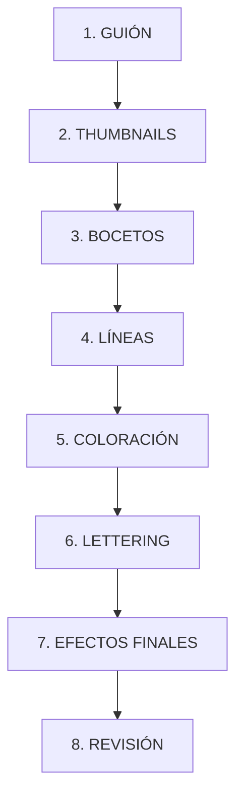

# Guía Maestra de Creación de Cómics - La Voûte d'Anaïs

*Investigación compilada por Helena de Anaïs*  
*Última actualización: 16 de diciembre de 2025*

---

## I. Fundamentos del Arte Secuencial

### ¿Qué es un Cómic?

El cómic es un medio de **narración visual secuencial** donde las imágenes, organizadas en paneles, crean una historia continua. A diferencia de una ilustración estática, el cómic guía al lector a través del tiempo, el espacio y las emociones mediante la composición deliberada de viñetas, diálogos y elementos gráficos.

> [!TIP]
> **Autores Clave para Estudiar:**
> - **Scott McCloud** - *Understanding Comics* (teoría del medio)
> - **Will Eisner** - *Comics and Sequential Art* (narrativa visual)
> - **Milo Manara** - Maestro del cómic erótico europeo
> - **Stjepan Sejic** - *Sunstone* (BDSM narrativo moderno)

---

## II. Tipos de Paneles y Layouts

### A. Tipos de Paneles

| Tipo de Panel | Descripción | Uso en La Voûte |
|---------------|-------------|------------------|
| **Panel Regular** | Rectángulo o cuadrado estándar con bordes consistentes | Secuencias de diálogo, ritmo constante |
| **Panel Irregular** | Formas no convencionales, diagonales, escalonados | Drama emocional, estados alterados de conciencia, transformaciones |
| **Splash Panel** | Ocupa una página entera | Momentos pivotales, revelaciones de Miss Doll, clímax de transformación |
| **Insert Panel** | Panel pequeño dentro de uno más grande | Detalles (uñas, labios), reacciones simultáneas |
| **Paneles Superpuestos** | Se intersectan o sobreponen | Acciones simultáneas, compresión temporal, escenas de hipnosis |
| **Panel Horizontal** | Largo y estrecho horizontalmente | Paisajes, escenas amplias de salón, establecimiento |
| **Panel Vertical** | Alto y estrecho verticalmente | Revelar cuerpo completo, transformación de pies a cabeza |
| **Panel Diagonal** | Colocado en ángulo | Dinamismo, tensión, desequilibrio emocional |
| **Marco Roto** | Elementos que exceden el borde del panel | Acción intensa, ruptura de la cuarta pared |
| **Panel de Caption** | Contiene solo texto | Narración interna, pensamientos hipnóticos |

### B. Sistemas de Grilla

#### Grillas Regulares
```
┌───┬───┬───┐     ┌───┬───┐     ┌───────┐
│ 1 │ 2 │ 3 │     │ 1 │ 2 │     │   1   │
├───┼───┼───┤     ├───┼───┤     ├───┬───┤
│ 4 │ 5 │ 6 │     │ 3 │ 4 │     │ 2 │ 3 │
├───┼───┼───┤     ├───┼───┤     ├───┴───┤
│ 7 │ 8 │ 9 │     │ 5 │ 6 │     │   4   │
└───┴───┴───┘     └───┴───┘     └───────┘
  Grilla 3x3        Grilla 2x3     Flexible
```

> [!IMPORTANT]
> **Para La Voûte recomendamos:**
> - **Grilla 3x3** para páginas de diálogo y transformación gradual
> - **Grilla 2x3** para balance entre acción y narración
> - **Layout Flexible** para momentos de impacto emocional

### C. El Gutter (Espacio entre Paneles)

El **gutter** es el espacio blanco entre paneles. Su anchura afecta el ritmo:

| Anchura | Efecto | Ejemplo en La Voûte |
|---------|--------|---------------------|
| **Estrecho** (2-3mm) | Momentos conectados, sucesión rápida | Secuencia de afirmaciones de Miss Doll |
| **Normal** (4-6mm) | Transición suave, ritmo estándar | Diálogos normales |
| **Ancho** (8-12mm) | Pausa dramática, cambio de escena | Antes/después de transformación |

---

## III. Globos de Diálogo y Texto

### A. Tipos de Globos (Speech Bubbles)

```
    ╭─────────────╮       ·  ·  ·  ·  ·         ╭╌╌╌╌╌╌╌╌╌╌╌╌╌╮
    │  DIÁLOGO    │      ·    PENSAMIENTO  ·    ╎  SUSURRO    ╎
    │  NORMAL     │       ·               ·     ╎             ╎
    ╰──────┬──────╯        · · · · · · · ·      ╰╌╌╌╌╌┬╌╌╌╌╌╌╌╯
           │                      │                   │
           ▼                      ○                   ▼
       [HABLANTE]              [PENSADOR]        [SUSURRADOR]
```

| Tipo de Globo | Forma Visual | Uso en La Voûte |
|---------------|--------------|------------------|
| **Estándar** | Óvalo con cola puntiaguda | Diálogo normal de personajes |
| **Pensamiento** | Nube con cadena de burbujas | Monólogo interno durante transformación |
| **Susurro** | Contorno punteado, texto gris | Palabras sensuales de Miss Doll |
| **Grito** | Bordes irregulares/explosivos | Momentos de shock, "¡LEXI!" |
| **Electrónico** | Rectangular, cola zigzag | Mensajes de texto, órdenes por radio |
| **Monstruo** | Aspecto goteante/viscoso | No aplicable (posible para personajes oscuros) |
| **Frío/Hostil** | Carámbanos en borde inferior | Amenazas, advertencias |
| **Débil** | Contorno ondulado, texto pequeño | Personajes en trance profundo |
| **Telepático** | Forma única, sin cola | Sugestiones hipnóticas implantadas |

### B. Reglas de Colocación

> [!CAUTION]
> **REGLA DE ORO:** El lector occidental lee de **izquierda a derecha**, **arriba abajo** (patrón "Z"). ¡Nunca violar este flujo!

1. **Primer globo** = más alto y más a la izquierda
2. **Cola del globo** apunta SIEMPRE a la boca/cabeza del hablante
3. **Nunca cruzar** colas sobre otros personajes o elementos clave
4. **No cubrir** arte importante (a menos que sea intencional)
5. **Máximo 25-35 palabras** por globo
6. **Múltiples líneas** de un personaje: apilar globos verticalmente

```
    ┌────────────────────────────────────┐
    │  1. "Primera línea de diálogo"     │  ← Leer primero
    │        ╭───────────────────╮       │
    │        │ 2. "Respuesta"    │       │  ← Leer segundo
    │        ╰────────┬──────────╯       │
    │                 ▼                  │
    │              [PERSONAJE B]         │
    │                                    │
    │  ╭──────────────╮                  │
    │  │ 3. "Continúa"│ ← Leer tercero   │
    │  ╰──────┬───────╯                  │
    │         ▼                          │
    │     [PERSONAJE A]                  │
    └────────────────────────────────────┘
```

### C. Tipografía y Estilo de Texto

| Elemento | Estilo Recomendado | Notas |
|----------|-------------------|-------|
| **Diálogo normal** | Mayúsculas, sans-serif | Estilo clásico cómic americano |
| **Énfasis** | **Negrita itálica** | Para palabras clave: "eres de los hombres que..." |
| **Susurro/sotto voce** | Texto más pequeño, gris | Afirmaciones hipnóticas |
| **Grito** | TEXTO GRANDE, bordes gruesos | Momentos de pánico o éxtasis |
| **Narración** | Diferente fuente, más elegante | Cajas rectangulares, color diferenciado |
| **Pensamientos** | Itálica | Dentro de burbujas de nube |

---

## IV. Cajas de Narración (Caption Boxes)

### A. Tipos de Caption

| Tipo | Formato | Ejemplo La Voûte |
|------|---------|------------------|
| **Ubicación/Tiempo** | Itálica, caja sin bordes | *"Hotel Excelsior. Salón de Conferencias..."* |
| **Monólogo Interno** | Itálica, borde coloreado | *"Y de pronto... era verdad. Siempre había sido así. ¿No?"* |
| **Caption Hablado** | No itálica, comillas | "Cada frase de Miss Doll reescribía su realidad." |
| **Editorial/Autor** | Itálica, borde distintivo | *"Continuará..."* |

### B. Diseño Visual

```
┌────────────────────────────────────────────────────────────┐
│  ╔═══════════════════════════════════════════════════╗    │
│  ║  CAPTION UBICACIÓN                                ║    │
│  ║  Fondo: Crema/Beige  │  Borde: Negro fino         ║    │
│  ║  Texto: Itálica, pequeño                          ║    │
│  ╚═══════════════════════════════════════════════════╝    │
│                                                            │
│  ╔═══════════════════════════════════════════════════╗    │
│  ║  CAPTION PENSAMIENTO (Miss Doll hablando)         ║    │
│  ║  Fondo: Rosa pastel  │  Borde: Rosa flúor         ║    │
│  ║  Texto: Cursiva sensual                           ║    │
│  ╚═══════════════════════════════════════════════════╝    │
│                                                            │
│  ╔═══════════════════════════════════════════════════╗    │
│  ║  CAPTION NARRADOR OMNISCIENTE                     ║    │
│  ║  Fondo: Blanco  │  Borde: Negro grueso            ║    │
│  ║  Texto: Regular, serif elegante                   ║    │
│  ╚═══════════════════════════════════════════════════╝    │
└────────────────────────────────────────────────────────────┘
```

---

## V. Efectos de Sonido (Onomatopeyas)

### A. Principios Básicos

| Factor | Efecto | Ejemplo |
|--------|--------|---------|
| **Tamaño** | Mayor = más fuerte | **BANG** vs. ^click^ |
| **Tipografía** | Estilo = naturaleza del sonido | Angular = explosivo, Fluido = suave |
| **Color** | Brillante = enérgico, Apagado = silencioso | Rosa flúor para tacones de Miss Doll |
| **Repetición** | Duración del sonido | "BEEP" vs. "BEEEEEP" |
| **Posición** | Cerca de la fuente del sonido | Al lado del tacón que hace click |

### B. Vocabulario Onomatopéyico para La Voûte

| Categoría | Sonidos | Uso |
|-----------|---------|-----|
| **Tacones** | CLICK CLICK CLICK, TAP TAP, CLACK | Entrada de Miss Doll, caminar de Lexi |
| **Corazón** | THUMP THUMP, BA-DUM, PUMP PUMP | Atracción, nerviosismo, excitación |
| **Suspiros** | shhh..., mmm..., ahhh... | Momentos sensuales, trance |
| **Risitas** | jiji, hehe, tee-hee | Risita bimbo característica |
| **Spray/Perfume** | PSSST, fssshhh | Niebla rosa de Miss Doll |
| **Aplausos** | CLAP CLAP CLAP, ¡BRAVO! | Reconocimiento, transformación completada |

---

## VI. Teoría del Color para Cómics

### A. Psicología del Color

| Color | Emoción/Significado | Uso en La Voûte |
|-------|---------------------|------------------|
| **Rosa** | Feminidad, romance, transformación | Color DOMINANTE - Miss Doll, transformación |
| **Rosa Flúor** | Intensidad, poder hipnótico | Afirmaciones, momentos de cambio |
| **Crema/Blanco** | Pureza, nuevo comienzo | Fondos, transiciones |
| **Lavanda** | Calma, transe, sueño | Estados hipnóticos profundos |
| **Gris** | Mundano, antes | Estado inicial del protagonista |
| **Negro** | Contraste, líneas, poder | Contornos, sombras, autoridad |
| **Rojo** | Pasión, peligro, labios | Acentos sensuales |

### B. Paleta Oficial La Voûte

```css
/* PALETA PRINCIPAL */
--rosa-pastel:    #FFB6C1;  /* Fondo, rubor */
--crema:          #FFFDD0;  /* Fondos neutros, captions */
--rosa-fluor:     #FF69B4;  /* Acentos, transformación */
--lavanda:        #E6E6FA;  /* Sueños, trance */
--gris-suave:     #D3D3D3;  /* Estado "antes" */

/* ACENTOS */
--rosa-labios:    #E75480;  /* Labios, detalles sensuales */
--negro-lineas:   #000000;  /* Contornos, texto */
--blanco:         #FFFFFF;  /* Highlights, brillos */
```

### C. Técnicas de Coloración

1. **Flatting:** Colores base planos sin degradados
2. **Sombreado:** Añadir tonos más oscuros en áreas de sombra
3. **Highlights:** Puntos de luz blancos en ojos, labios, superficies brillantes
4. **Gradientes:** Transiciones suaves para atmósfera (niebla rosa)
5. **Halftone (Ben-Day):** Puntos de trama para estilo retro años 60

> [!NOTE]
> **Para estilo Romance Comics años 60:**
> - Usar halftone/puntos Ben-Day en mejillas para rubor
> - Líneas negras limpias y definidas
> - Colores pastel predominantes
> - Destellos de estrella en ojos para expresar emoción

---

## VII. Estilos Visuales Específicos

### A. Convenciones del Cómic de Romance

| Elemento | Convención | Implementación |
|----------|------------|----------------|
| **Expresiones** | Exageradas para emoción | Ojos enormes, rubor visible, lágrimas de alegría |
| **Coloreado** | Suave, evocador | Rosa pastel, crema, lavanda |
| **Paneles** | Fluidos, a veces sin bordes | Para momentos emocionales |
| **Close-ups** | Frecuentes en rostros | Capturar micro-expresiones de transformación |
| **Fondos** | A menudo abstractos o patrones | Patrones geométricos, corazones, destellos |

### B. Convenciones del Cómic Erótico

| Elemento | Convención | Implementación La Voûte |
|----------|------------|--------------------------|
| **Figuras** | Detalladas, expresivas | Énfasis en lenguaje corporal |
| **Iluminación** | Dramática, evocadora | Sombras sensuales, brillos en látex |
| **Composición** | Guía el foco visual | Dirigir la mirada a puntos de transformación |
| **Simbolismo** | Imágenes sugerentes | Espejos, niebla rosa, hilos de títere |
| **Profundidad** | Más allá de lo visual | Explorar psicología de la transformación |

### C. Influencia Manga/Webtoon

| Técnica | Descripción | Aplicación |
|---------|-------------|------------|
| **Speedlines** | Líneas de velocidad para movimiento | Tacones de Miss Doll entrando |
| **Efectos de fondo** | Patrones abstractos para emoción | Corazones, burbujas, espirales |
| **Expresiones SD** | Versiones simplificadas cómicas | Momentos de confusión del protagonista |
| **Formato Vertical** | Scroll continuo | Para versión webtoon de historias |

---

## VIII. Ángulos de Cámara y Composición

### A. Tipos de Tomas

| Toma | Descripción | Uso Narrativo |
|------|-------------|---------------|
| **Plano General (Wide Shot)** | Muestra ubicación completa | Establecer escena (Hotel Excelsior) |
| **Plano Medio (Medium Shot)** | Personaje de cintura arriba | Conversaciones, interacciones |
| **Primer Plano (Close-Up)** | Rostro o detalle | Emociones, reacciones, transformación |
| **Plano Detalle (Extreme Close-Up)** | Un elemento aislado | Uñas, labios, ojos con corazones |
| **Plano Picado (High Angle)** | Desde arriba | Vulnerabilidad del protagonista |
| **Contrapicado (Low Angle)** | Desde abajo | Poder de Miss Doll, autoridad del Jefe |

### B. Regla de los Tercios

```
┌───────────┬───────────┬───────────┐
│           │           │           │
│     ●─────┼─────●     │           │
│           │     ↑     │           │
├───────────┼─────┼─────┼───────────┤
│           │  FOCO  │           │
│           │ PRINCIPAL│           │
│     ●─────┼─────●     │           │
├───────────┼───────────┼───────────┤
│           │           │           │
│           │           │           │
│           │           │           │
└───────────┴───────────┴───────────┘

Los puntos ● marcan los "puntos de poder"
donde colocar elementos importantes
```

---

## IX. Generación de Cómics con IA

### A. Mejores Prácticas de Prompts

> [!IMPORTANT]
> **REGLA FUNDAMENTAL:** La consistencia del personaje es el mayor desafío. Usar SIEMPRE el mismo prompt base para cada personaje.

#### Estructura de Prompt Recomendada

```
[ESTILO ARTÍSTICO], [TÉCNICA], [ATMÓSFERA].
[DESCRIPCIÓN DE ESCENA/COMPOSICIÓN].
[PERSONAJE 1]: [descripción detallada canon].
[PERSONAJE 2]: [descripción detallada canon].
[ELEMENTOS DE FONDO].
[EFECTOS VISUALES].
[PALETA DE COLORES].
```

#### Ejemplo de Prompt (Miss Doll)

```
Comic book panel, 60s romance style, halftone texture, pink pastel atmosphere.
Full body shot of woman in elegant conference room.
MISS DOLL: living doll sensual appearance, voluminous platinum blonde bob 
with straight bangs, huge Bratz-style eyes with long lashes and black 
cat-eye liner, pink eyelids, high arched brows, heart-shaped pink/nude 
glossy lips, flirty seductive expression, artificial pink poreless 
shiny skin, hourglass figure (large rounded bust, very narrow waist, 
curvy hips), bright pink latex catsuit with V-neckline, pink choker, 
very high pink platform heels. Sensual confident pose, hand on hip.
Background: conference room with geometric patterns.
Star sparkles around her, pink mist swirling.
Color palette: pink, cream, hot pink accents.
```

### B. Mantener Consistencia de Personaje

| Técnica | Descripción | Implementación |
|---------|-------------|----------------|
| **Prompt Fijo** | Usar descripción idéntica siempre | Copiar/pegar sección de personaje |
| **Imagen de Referencia** | Subir imagen aprobada | `MISS_DOLL_CANON_COMIC.jpg` |
| **Seed Number** | Número fijo para estilo | En Midjourney: `--seed 12345` |
| **Negative Prompts** | Excluir elementos indeseados | `--no red lips, asymmetric bangs` |
| **Check-list Visual** | Verificar cada imagen | ¿Flequillo recto? ¿Labios rosa? |

### C. Palabras Clave para Estilos

| Estilo | Keywords de Prompt |
|--------|-------------------|
| **Romance años 60** | `60s romance comic, halftone, Ben-Day dots, vintage, hand-lettered` |
| **Manga** | `manga style, anime, sparkle eyes, speed lines, shoujo` |
| **Pin-up** | `pin-up style, glamour, retro, vintage illustration` |
| **Cómic Europeo** | `bande dessinée, European comic, ligne claire` |
| **Webtoon** | `webtoon style, soft colors, vertical scroll format` |

### D. Herramientas Recomendadas

| Herramienta | Fortaleza | Debilidad |
|-------------|-----------|-----------|
| **Adobe Firefly** | Integración con CC, layouts | Menos control fino |
| **Midjourney** | Calidad artística | Inconsistencia de personajes |
| **DALL-E** | Instrucciones naturales | Limitado en estilos específicos |
| **ComicsMaker.ai** | Diseñado para cómics | Menos flexibilidad artística |
| **OpenArt** | Consistencia de personaje | Curva de aprendizaje |

---

## X. Workflow de Producción

### A. Fases de Creación



### B. Checklist por Página

- [ ] **Guión aprobado** con diálogos y descripciones
- [ ] **Layout definido** (número y distribución de paneles)
- [ ] **Prompts preparados** para cada panel
- [ ] **Imágenes generadas** y seleccionadas
- [ ] **Consistencia verificada** (¿personajes correctos?)
- [ ] **Globos de diálogo** colocados correctamente
- [ ] **Captions** añadidos
- [ ] **Efectos de sonido** integrados
- [ ] **Revisión final** de flujo de lectura

---

## XI. Especificaciones Técnicas La Voûte

### A. Formato de Página

| Especificación | Valor |
|----------------|-------|
| **Tamaño** | 2480 x 3508 px (A4 @ 300dpi) |
| **Resolución** | 300 DPI mínimo |
| **Formato** | PNG (preservar transparencia) |
| **Márgenes** | 3mm bleed para impresión |
| **Zona segura** | 5mm interior desde borde |

### B. Estructura de Carpetas

```
05_Imagenes/comics/
├── [titulo_del_comic]/
│   ├── guion_comic.md
│   ├── referencias/
│   │   └── personaje_canon.jpg
│   ├── imagenes/
│   │   ├── pag01_portada.png
│   │   ├── pag02_escena.png
│   │   └── ...
│   ├── descartadas/
│   │   └── (versiones rechazadas)
│   └── final/
│       └── (páginas terminadas con lettering)
```

### C. Nomenclatura de Archivos

```
pag[XX]_[descripcion].png

Ejemplos:
pag01_portada.png
pag02_llegada.png
pag03_miss_doll_entrada.png
pag04_primera_afirmacion.png
```

---

## XII. Referencias Visuales y Ejemplos

### A. Artistas de Referencia

| Artista | Estilo | Relevancia La Voûte |
|---------|--------|---------------------|
| **Sacha Massacre** | Goth Pin-Up | Estética de Helena |
| **Milo Manara** | Erótico europeo | Sensualidad elegante |
| **Stjepan Sejic** | BDSM moderno | Dinámicas de poder |
| **Adam Hughes** | Pin-up cómic | Figuras femeninas |
| **Romance Comics años 50-60** | Vintage | Estilo base de nuestros cómics |

### B. Canon Visual Miss Doll

> **Ubicación de Referencia:** `05_Imagenes/miss_doll/MISS_DOLL_CANON_COMIC.jpg`

**Checklist de Verificación:**
- [ ] Cabello: Bob platino, flequillo **RECTO** (no asimétrico)
- [ ] Ojos: Enormes estilo Bratz, párpados **ROSADOS**
- [ ] Labios: Forma corazón, **rosa/nude** (NO rojos)
- [ ] Expresión: SIEMPRE sensual, coqueta, seductora
- [ ] Cuerpo: Reloj de arena exagerado
- [ ] Vestimenta: Catsuit rosa flúor látex brillante
- [ ] Accesorios: Choker rosa, tacones plataforma rosa

---

## XIII. Glosario de Términos

| Término | Definición |
|---------|------------|
| **Bleed** | Área que se extiende más allá del borde de corte |
| **Caption** | Caja de texto narrativo |
| **Gutter** | Espacio entre paneles |
| **Halftone** | Técnica de puntos para crear tonos (Ben-Day dots) |
| **Letterer** | Persona que añade texto al cómic |
| **Panel** | Viñeta individual |
| **SFX** | Efectos de sonido (Sound Effects) |
| **Splash Page** | Página con un solo panel grande |
| **Spread** | Imagen que abarca dos páginas |
| **Thumbnail** | Boceto pequeño de layout |
| **Word Balloon** | Globo de diálogo |

---

## XIV. Recursos Adicionales

### Libros Recomendados
- *Understanding Comics* - Scott McCloud
- *Making Comics* - Scott McCloud
- *Comics and Sequential Art* - Will Eisner
- *Framed Ink* - Marcos Mateu-Mestre

### Sitios Web
- [Clip Studio Tips](https://tips.clip-studio.com/) - Tutoriales
- [Blambot](https://www.blambot.com/) - Fuentes para cómics
- [Comic Book Resources](https://www.cbr.com/) - Noticias e inspiración

---

*"El cómic es poesía visual, donde cada panel es un verso y cada página un poema completo."*

*— Helena de Anaïs 🌙*
