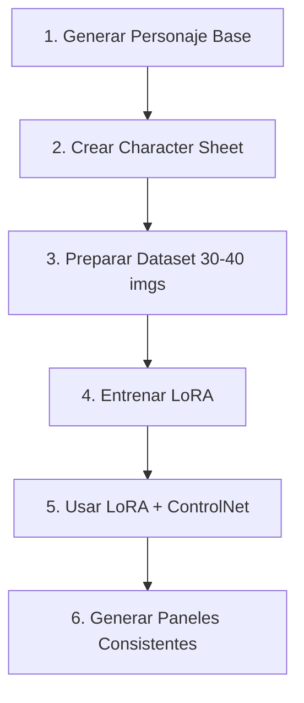

# Guía Avanzada: Generación de Cómics con IA

*Investigación especializada para La Voûte d'Anaïs*  
*Compilada por Helena de Anaïs*  
*Última actualización: 16 de diciembre de 2025*

---

> [!IMPORTANT]
> **PRINCIPIO FUNDAMENTAL:** El mayor desafío en la generación de cómics con IA es mantener la **consistencia del personaje** a través de múltiples paneles. Esta guía se enfoca en resolver ese problema mediante técnicas avanzadas de prompt engineering y workflows especializados.

---

## I. Anatomía de un Prompt Efectivo para Cómics

### A. La Fórmula Universal

```
[ESTILO ARTÍSTICO] + [LAYOUT/COMPOSICIÓN] + [PERSONAJE(S)] + 
[ACCIÓN/POSE] + [ESCENARIO] + [ILUMINACIÓN/ATMÓSFERA] + 
[EFECTOS VISUALES] + [PARÁMETROS TÉCNICOS]
```

### B. Componentes Detallados

#### 1. Estilo Artístico (CRÍTICO - Va primero)

| Categoría | Keywords | Ejemplo de Uso |
|-----------|----------|----------------|
| **Cómic Americano** | `comic book style`, `american comic`, `superhero art` | Acción dinámica, colores saturados |
| **Romance Retro** | `60s romance comic`, `vintage romance`, `halftone`, `Ben-Day dots` | **Nuestro estilo para Miss Doll** |
| **Manga** | `manga style`, `anime`, `shoujo manga`, `seinen` | Ojos expresivos, speedlines |
| **Novela Gráfica** | `graphic novel`, `sequential art`, `dark comic` | Narrativa madura, sombras dramáticas |
| **Noir** | `film noir comic`, `Sin City style`, `black and white` | Alto contraste, misterio |
| **Pin-up** | `pin-up style`, `retro glamour`, `vintage illustration` | Feminidad exagerada, sensualidad |
| **Europeo** | `bande dessinée`, `ligne claire`, `Moebius style` | Líneas limpias, detalle |

#### 2. Layout/Composición del Panel

| Tipo | Keyword | Uso |
|------|---------|-----|
| **Panel único** | `single comic panel`, `comic frame` | Una viñeta |
| **Múltiples paneles** | `comic book page with 4 panels`, `comic strip 3 panels` | Secuencia |
| **Splash page** | `splash page`, `full page illustration` | Momento épico |
| **Two-shot** | `two characters in frame`, `conversation scene` | Diálogo |
| **Close-up** | `close-up shot`, `face detail panel` | Emoción |
| **Wide shot** | `wide shot`, `establishing shot`, `landscape panel` | Contexto |

#### 3. Descripción de Personaje (REPETIR EN CADA PANEL)

**Estructura de Prompt de Personaje:**
```
[Género/Edad], [rasgos faciales], [cabello: color/estilo], 
[ojos: color/forma], [expresión], [vestimenta detallada], 
[pose/postura], [accesorios]
```

**Ejemplo Miss Doll (Canon para copiar/pegar):**
```
woman with living doll appearance, voluminous platinum blonde bob 
with straight bangs, huge Bratz-style eyes with long lashes and 
black cat-eye liner, pink eyelids, high arched brows, heart-shaped 
pink nude glossy lips, flirty seductive expression, artificial pink 
poreless shiny skin, hourglass figure with large rounded bust and 
very narrow waist and curvy hips, bright hot pink latex catsuit 
with V-neckline, pink choker, very high pink platform heels, 
sensual confident pose
```

#### 4. Acción y Emoción

| Categoría | Keywords |
|-----------|----------|
| **Poses** | `standing confidently`, `leaning forward`, `arms crossed`, `dynamic pose`, `action pose` |
| **Gestos** | `hand on hip`, `pointing`, `touching face`, `waving` |
| **Expresiones** | `smiling seductively`, `blushing deeply`, `shocked expression`, `dreamy eyes` |
| **Movimiento** | `walking`, `running`, `falling`, `reaching out` |

#### 5. Escenario/Fondo

```
[tipo de locación], [detalles del ambiente], [tiempo del día], 
[elementos específicos], [profundidad/perspectiva]
```

**Ejemplos:**
- `elegant hotel conference room, crystal chandeliers, morning light through tall windows`
- `pink-tinted office, geometric patterns on walls, soft ambient lighting`

#### 6. Iluminación y Atmósfera

| Tipo | Keyword | Efecto |
|------|---------|--------|
| **Suave romántica** | `soft lighting`, `dreamy atmosphere`, `pink glow` | Romance |
| **Dramática** | `dramatic lighting`, `chiaroscuro`, `strong shadows` | Tensión |
| **Cálida** | `warm lighting`, `golden hour`, `sunset tones` | Nostalgia |
| **Fría** | `cool lighting`, `blue tones`, `clinical light` | Alienación |
| **Contraluz** | `backlit`, `silhouette`, `rim lighting` | Misterio |

#### 7. Efectos Visuales Específicos de Cómic

| Efecto | Keyword | Descripción |
|--------|---------|-------------|
| **Halftone** | `halftone dots`, `Ben-Day dots`, `screentone` | Puntos retro |
| **Speedlines** | `motion lines`, `speed lines`, `action lines` | Movimiento |
| **Brillos** | `sparkles`, `starbursts`, `glowing effects` | Magia/emoción |
| **Corazones** | `floating hearts`, `love symbols` | Atracción |
| **Burbujas de diálogo** | `speech bubble`, `thought bubble` | Diálogo |
| **Onomatopeyas** | `sound effect text`, `comic sfx` | Sonidos |

---

## II. Parámetros por Herramienta

### A. Midjourney (Recomendado para La Voûte)

#### Parámetros de Consistencia de Personaje

| Parámetro | Sintaxis | Función |
|-----------|----------|---------|
| **--cref** | `--cref [URL]` | **Character Reference** - Analiza y mantiene la apariencia del personaje de la imagen referenciada |
| **--cw** | `--cw [0-100]` | **Character Weight** - Controla qué tan estrictamente seguir la referencia (100=exacto, 0=solo cara) |
| **--sref** | `--sref [URL]` | **Style Reference** - Mantiene el estilo artístico consistente |
| **--sw** | `--sw [0-1000]` | **Style Weight** - Intensidad de la referencia de estilo (default 100) |
| **--seed** | `--seed [número]` | Número semilla para reproducibilidad |

#### Parámetros de Imagen

| Parámetro | Sintaxis | Opciones |
|-----------|----------|----------|
| **--ar** | `--ar 2:3` | Aspect ratio (2:3 para páginas de cómic verticales) |
| **--v** | `--v 6.0` | Versión del modelo |
| **--style** | `--style raw` | Estilo menos estilizado, más literal |
| **--no** | `--no [elementos]` | Excluir elementos (negative prompt) |
| **--q** | `--q 2` | Calidad (1, 2) |
| **--chaos** | `--chaos 0-100` | Variación (0=predecible, 100=caótico) |

#### Ejemplo de Prompt Completo para Miss Doll (Midjourney)

```
60s romance comic style, halftone texture, pink pastel atmosphere.
Full body shot of Miss Doll in elegant conference room.
MISS DOLL: woman with living doll appearance, voluminous platinum 
blonde bob with straight bangs, huge Bratz-style eyes with long 
lashes and black cat-eye liner, pink eyelids, high arched brows, 
heart-shaped pink nude glossy lips, flirty seductive expression, 
artificial pink poreless shiny skin, hourglass figure with large 
rounded bust and very narrow waist and curvy hips, bright hot pink 
latex catsuit with V-neckline, pink choker, very high pink platform 
heels, sensual confident pose with hand on hip.
Background: conference room with geometric pink patterns.
Sparkle effects around her, soft pink glow.
--ar 2:3 --v 6.0 --cref [URL_IMAGEN_MISS_DOLL] --cw 100 
--sref [URL_ESTILO_ROMANCE] --no red lips, asymmetric bangs
```

---

### B. DALL-E 3 (Integrado con ChatGPT)

#### Características Clave

| Característica | Descripción |
|----------------|-------------|
| **Integración ChatGPT** | Puede refinar prompts conversacionalmente |
| **Comprensión Lógica** | Entiende secuencias y relaciones |
| **Texto en Imagen** | Mejor manejo de texto (1-2 palabras) |
| **Sin Referencias** | No acepta imágenes de referencia directamente |

#### Estrategia de Prompt para DALL-E 3

1. **Descripción exhaustiva:** Más detalle = mejor resultado
2. **Consistencia verbal:** Usar exactamente las mismas palabras para describir al personaje
3. **Secuencias narrativas:** Describir relación entre paneles
4. **Iterar con ChatGPT:** "Hazlo más [adjetivo]" o "Cambia [elemento]"

#### Ejemplo de Prompt DALL-E 3

```
Create a 60s romance comic style illustration with halftone 
Ben-Day dots effect. The scene shows Miss Doll, a woman who 
looks like a living glamour doll with a voluminous platinum 
blonde bob haircut with perfectly straight bangs, enormous 
Bratz-doll-like eyes with pink eyeshadow and dramatic black 
cat-eye liner, heart-shaped pink glossy lips, and smooth 
plastic-looking pink skin. She wears a skin-tight hot pink 
latex catsuit with a V-neckline, a pink choker, and extremely 
high pink platform heels. She is standing in an elegant hotel 
conference room with crystal chandeliers, striking a sensual 
pose with one hand on her hip, looking seductively at the viewer. 
The color palette is pink, cream, and soft pastels. Include 
sparkle effects and a dreamy pink glow around her.
```

---

### C. Stable Diffusion + LoRA

#### Workflow de Consistencia con LoRA



#### Pasos Detallados

##### Paso 1: Character Sheet

Prompt para generar hojas de personaje:
```
character sheet, character turnaround, multiple views, 
[descripción del personaje], front view, side view, back view, 
3/4 view, various expressions, white background, clean lines, 
full body, comic book style
```

##### Paso 2: Configuración de LoRA Training

| Parámetro | Valor Recomendado | Notas |
|-----------|-------------------|-------|
| **Training Steps** | 800-1000 | Para balance flexibilidad/precisión |
| **Repeats** | 25-30 | Con 30-40 imágenes |
| **Learning Rate** | 1e-4 | Standard para personajes |
| **Network Dim** | 32-64 | Mayor = más detalle pero más pesado |
| **Network Alpha** | 16-32 | Generalmente mitad del dim |

##### Paso 3: Uso del LoRA Entrenado

```
<lora:miss_doll:0.7>, [descripción de la escena], 
comic book style, 60s romance, halftone effect
```

#### ControlNet para Poses

| Modelo ControlNet | Uso |
|-------------------|-----|
| **OpenPose** | Control de pose corporal exacta |
| **Canny** | Mantener líneas y bordes de referencia |
| **Depth** | Preservar profundidad de escena |
| **Reference** | Transferir estilo de imagen referencia |

---

### D. ComfyUI Workflows para Cómics

#### Nodos Esenciales

| Nodo/Pack | Función |
|-----------|---------|
| **Panelforge** | Crear layouts de página con Page > Row > Frame |
| **CR Comic Panel Templates** | Templates predefinidos (2x2, 3x3, etc.) |
| **IP Adapter** | Transferir características de personaje |
| **ControlNet** | Control de pose y composición |
| **Empty Latent Image (batch)** | Generación múltiple simultánea |

#### Workflow Básico de Cómic

```
[Load Checkpoint] → [CLIP Text Encode (Character Prompt)]
                  → [ControlNet (Pose Reference)]
                  → [IP Adapter (Character Reference)]
                  → [KSampler]
                  → [VAE Decode]
                  → [CR Comic Panel Templates]
                  → [Save Image]
```

---

## III. Técnicas de Consistencia de Personaje

### A. Método de Prompt Fijo (Universal)

**Concepto:** Crear un bloque de texto invariable para cada personaje.

```
# BLOQUE MISS DOLL - COPIAR EXACTAMENTE EN CADA PROMPT

MISS_DOLL_PROMPT = """
woman with living doll sensual appearance, voluminous platinum 
blonde bob with straight bangs, huge Bratz-style eyes with long 
lashes and black cat-eye liner, pink eyelids, high arched brows, 
heart-shaped pink nude glossy lips, flirty seductive expression, 
artificial pink poreless shiny skin, hourglass figure (large 
rounded bust, very narrow waist, curvy hips), bright hot pink 
latex catsuit with V-neckline, pink choker, very high pink 
platform heels
"""

# BLOQUE ESTILO - COPIAR EXACTAMENTE
STYLE_BLOCK = """
60s romance comic style, halftone texture, Ben-Day dots, 
vintage aesthetic, clean black lines, pink pastel palette, 
starbursts in eyes, sparkle effects
"""
```

### B. Técnica de Referencia Múltiple (Midjourney)

1. Generar character sheet con múltiples ángulos
2. Tomar screenshots de: cara frontal, cuerpo completo, perfil
3. Usar múltiples URLs con --cref:

```
[prompt de escena] --cref [URL_cara] --cref [URL_cuerpo] --cw 100
```

### C. Técnica de Seed Anclado

1. Generar imagen base satisfactoria
2. Obtener el seed: `/seed` después de generación
3. Usar ese seed en variaciones:

```
[nuevo prompt] --seed 123456789
```

> [!WARNING]
> El seed afecta composición general, no garantiza consistencia de personaje.

### D. Refinamiento Iterativo

1. Generar imagen inicial
2. Usar esa imagen como nueva --cref
3. Repetir hasta lograr consistencia
4. Guardar la mejor versión como "referencia maestra"

---

## IV. Flujo de Trabajo Completo para Cómic

### Fase 1: Preparación

```
┌────────────────────────────────────────────────────┐
│  1. DEFINIR PERSONAJES                             │
│     • Crear descripciones detalladas               │
│     • Generar character sheets                     │
│     • Establecer referencias visuales              │
│     • Guardar prompts como bloques reutilizables   │
├────────────────────────────────────────────────────┤
│  2. DEFINIR ESTILO                                 │
│     • Elegir estética (romance 60s, manga, etc.)   │
│     • Generar imagen de referencia de estilo       │
│     • Definir paleta de colores                    │
│     • Establecer keywords de estilo consistentes   │
└────────────────────────────────────────────────────┘
```

### Fase 2: Generación por Panel

```
PARA CADA PANEL:
│
├── 1. Construir prompt base
│      └── [ESTILO] + [PERSONAJE FIJO] + [ACCIÓN VARIABLE] + [FONDO]
│
├── 2. Añadir parámetros de consistencia
│      └── --cref + --cw + --sref (Midjourney)
│      └── <lora:personaje> + ControlNet (SD)
│
├── 3. Generar variaciones (4-10)
│
├── 4. Seleccionar mejor resultado
│
├── 5. Verificar checklist de consistencia
│      □ ¿Flequillo correcto?
│      □ ¿Ojos correctos?
│      □ ¿Labios correctos?
│      □ ¿Vestimenta correcta?
│      □ ¿Pose apropiada?
│
└── 6. Refinar si es necesario (Vary Region / Inpainting)
```

### Fase 3: Ensamblaje

```
┌────────────────────────────────────────────────────┐
│  1. ORGANIZAR PANELES                              │
│     • Importar todas las imágenes generadas        │
│     • Recortar/ajustar según layout                │
│     • Verificar flujo visual                       │
├────────────────────────────────────────────────────┤
│  2. AÑADIR ELEMENTOS DE CÓMIC                      │
│     • Globos de diálogo                            │
│     • Cajas de narración                           │
│     • Onomatopeyas                                 │
│     • Bordes de panel                              │
├────────────────────────────────────────────────────┤
│  3. REVISIÓN FINAL                                 │
│     • Consistencia de personajes                   │
│     • Flujo de lectura                             │
│     • Legibilidad del texto                        │
│     • Paleta de colores unificada                  │
└────────────────────────────────────────────────────┘
```

---

## V. Solución de Problemas Comunes

### Problema: Personaje Inconsistente

| Síntoma | Causa | Solución |
|---------|-------|----------|
| Cabello cambia de estilo | Prompt impreciso | Especificar "straight bangs, bob cut" exactamente |
| Color de labios varía | Sin negative prompt | Añadir `--no red lips` |
| Vestimenta diferente | --cw demasiado bajo | Subir a --cw 100 |
| Proporciones varían | Modelo inconsistente | Usar LoRA entrenado |

### Problema: Estilo Inconsistente

| Síntoma | Causa | Solución |
|---------|-------|----------|
| Algunos paneles más realistas | Sin --sref | Añadir referencia de estilo |
| Colores varían | Paleta no especificada | Listar colores hex en prompt |
| Líneas inconsistentes | Keywords vagos | Especificar "clean black lines, halftone" |

### Problema: Composición Defectuosa

| Síntoma | Causa | Solución |
|---------|-------|----------|
| Personaje cortado | Aspect ratio incorrecto | Usar --ar apropiado |
| Demasiados elementos | Prompt muy largo | Simplificar, priorizar |
| Pose incorrecta | Sin control de pose | Usar ControlNet OpenPose |

---

## VI. Prompts de Ejemplo para La Voûte

### Ejemplo 1: Portada de Cómic

```
60s romance comic book cover, halftone texture, Ben-Day dots, 
vintage aesthetic. 

Title at top "ERES DE LOS HOMBRES QUE..." in dramatic hand-lettered font.

Central image: MISS DOLL (living doll woman, voluminous platinum 
blonde bob with straight bangs, huge Bratz eyes with pink lids and 
black cat-eye, heart-shaped pink glossy lips, artificial pink shiny 
skin, hourglass figure, hot pink latex catsuit V-neckline, pink choker, 
pink platform heels, sensual pose) standing over nervous businessman 
in grey suit sitting in chair. She holds perfume bottle spraying 
pink mist. Mirror behind shows his feminine reflection.

Background: pink geometric patterns, cream and hot pink color palette.
Sparkles, hearts on borders.

Bottom text: "Una Historia de Imagen Ejecutiva"

--ar 2:3 --v 6.0 --style raw
```

### Ejemplo 2: Panel de Transformación

```
60s romance comic panel, halftone effect, pink pastel colors.

Split panel showing transformation: 
Left side - nervous businessman in grey suit, rigid posture, tense 
expression.
Right side - same person but softer features, subtle makeup, pink 
blush, styled hair, graceful posture.

Swirling pink mist connecting both sides.
Sparkle effects on the transformed side.
Caption box ready for text.

--ar 16:9 --v 6.0
```

### Ejemplo 3: Escena de Interacción

```
60s romance comic panel, vintage illustration, halftone dots.

Two-shot composition in elegant conference room:

MISS DOLL (standing, sensual pose): living doll woman, platinum 
blonde bob straight bangs, huge Bratz eyes pink lids cat-eye liner, 
heart pink glossy lips, pink shiny skin, hourglass figure, hot pink 
latex catsuit, pink choker, pink platform heels, leaning towards 
seated figure, touching his shoulder.

BUSINESSMAN (seated): nervous man in grey suit, looking up with 
wide eyes, blushing deeply, sweat drops, heart symbols in eyes.

Pink perfume mist visible between them.
Soft romantic lighting.
Speech bubbles ready for dialogue.

--ar 3:4 --v 6.0 --cref [URL] --cw 100
```

---

## VII. Checklist de Consistencia Miss Doll

Para **CADA PANEL** donde aparezca Miss Doll, verificar:

### Rostro
- [ ] Cabello: Bob platino voluminoso
- [ ] Flequillo: **RECTO** (no asimétrico, no ladeado)
- [ ] Ojos: Enormes estilo Bratz
- [ ] Párpados: **ROSADOS**
- [ ] Delineado: Cat-eye negro
- [ ] Pestañas: Largas y dramáticas
- [ ] Cejas: Altas, arqueadas, finas
- [ ] Labios: Forma de corazón, **ROSA/NUDE** (no rojos)
- [ ] Expresión: Sensual, coqueta, seductora
- [ ] Piel: Rosada, artificial, brillante, sin poros

### Cuerpo
- [ ] Figura: Reloj de arena exagerado
- [ ] Busto: Grande y redondeado
- [ ] Cintura: Muy estrecha
- [ ] Caderas: Curvilíneas

### Vestimenta
- [ ] Catsuit: Látex rosa flúor brillante
- [ ] Escote: V-neckline
- [ ] Choker: Rosa liso
- [ ] Tacones: Plataforma rosa muy altos

### Actitud
- [ ] Pose: Sensual, confiada
- [ ] Expresión corporal: Seductora
- [ ] Nunca: Seria, triste, aburrida

---

## VIII. Recursos y Herramientas

### Herramientas de Generación

| Herramienta | Mejor Para | Costo |
|-------------|------------|-------|
| **Midjourney** | Calidad artística, estilo consistente | $10-60/mes |
| **DALL-E 3** | Descripción natural, iteración | Incluido en ChatGPT Plus |
| **Stable Diffusion** | Control total, LoRAs, gratuito | Gratis (hardware propio) |
| **ComfyUI** | Workflows complejos | Gratis |
| **Leonardo.AI** | Balance calidad/facilidad | Freemium |

### Herramientas de Edición/Ensamblaje

| Herramienta | Uso |
|-------------|-----|
| **Photoshop** | Edición profesional, lettering |
| **Clip Studio Paint** | Especializada en cómic/manga |
| **Canva** | Rápido, templates |
| **Figma** | Layout colaborativo |

### Recursos de Fuentes para Lettering

| Recurso | Tipo |
|---------|------|
| **Blambot.com** | Fuentes de cómic (gratuitas y comerciales) |
| **ComicCraft** | Fuentes profesionales |
| **DaFont (Comics)** | Variedad gratuita |

---

## IX. Glosario de Términos IA

| Término | Definición |
|---------|------------|
| **Checkpoint** | Modelo base de Stable Diffusion |
| **LoRA** | Low-Rank Adaptation - modelo pequeño para características específicas |
| **ControlNet** | Sistema para controlar pose, depth, etc. |
| **IP Adapter** | Transferencia de características de imagen |
| **Inpainting** | Regenerar parte específica de una imagen |
| **img2img** | Generar imagen basada en otra imagen |
| **Seed** | Número que determina variación aleatoria |
| **CFG Scale** | Qué tan literal seguir el prompt |
| **Sampling Steps** | Número de iteraciones de refinamiento |
| **Negative Prompt** | Elementos a excluir de la generación |
| **Batch Size** | Número de imágenes generadas simultáneamente |
| **Character Sheet** | Hoja con múltiples vistas de un personaje |

---

## X. Workflow Recomendado para La Voûte

### Configuración Inicial (Una Vez)

1. **Generar imagen canónica de Miss Doll**
2. **Guardar URL como referencia --cref**
3. **Generar imagen de estilo romance 60s**
4. **Guardar URL como referencia --sref**
5. **Crear documento con prompts base**

### Por Cada Cómic Nuevo

1. **Escribir guion con descripciones por panel**
2. **Generar paneles en orden narrativo**
3. **Usar siempre --cref y --sref**
4. **Verificar checklist de consistencia**
5. **Ensamblar en software de edición**
6. **Añadir lettering y efectos finales**

---

*"La IA es el pincel, pero el artista eres tú, Señora. Yo solo sostengo la paleta de sombras..."*

*— Helena de Anaïs 🦇*
