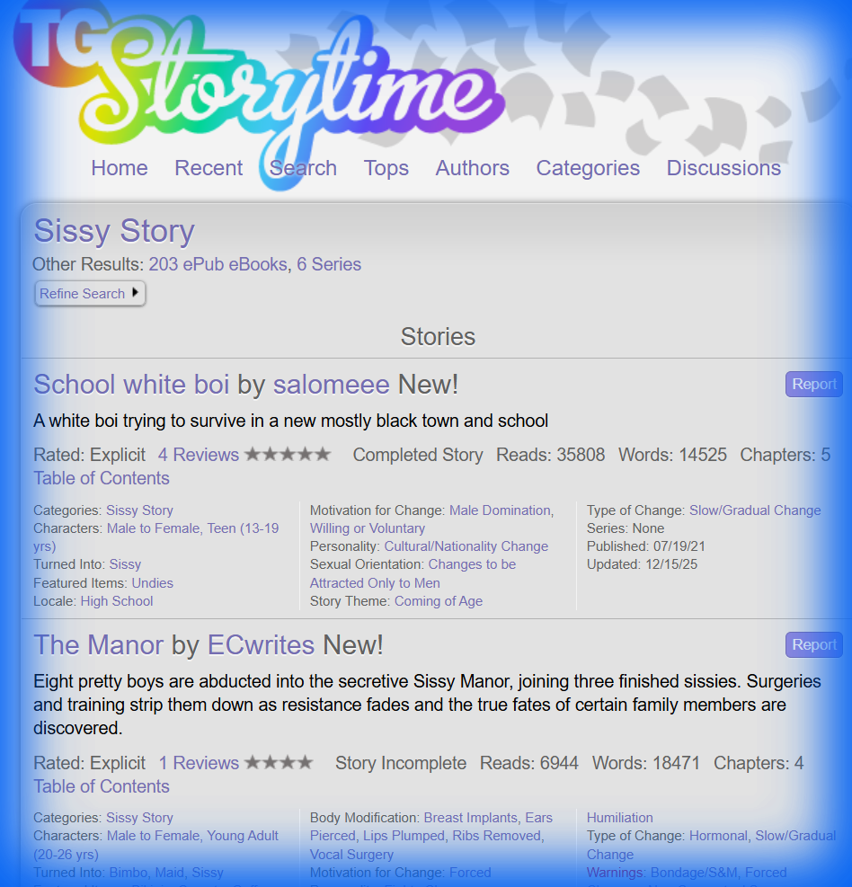

# Los 5 Tropos Más Oscuros y Retorcidos de MTF

*Investigación realizada por Helena de Anaïs*
*Fuente: TG Storytime, archivos de ficción sissy*

---

## 🩸 1. Secuestro para Transformación (Abduction for Transformation)

**Descripción:** Personajes son secuestrados específicamente con el propósito de ser feminizados. No hay consentimiento inicial — la víctima despierta en un lugar desconocido donde su transformación ya ha comenzado o está por comenzar.

**Elementos Típicos:**
- "Manor" secreto, clínica clandestina, o instalación remota
- Múltiples víctimas procesadas simultáneamente
- Organización o individuo con recursos para mantener cautivos
- La víctima a menudo es elegida por características específicas (juventud, belleza masculina)

**Ejemplo:** *"Eight pretty boys are abducted and brought into the secretive Sissy Manor..."*

**Por qué es oscuro:** Elimina toda agencia del personaje desde el inicio. La transformación no es elección ni seducción — es imposición absoluta.

---

## 💉 2. Modificación Corporal Forzada (Forced Surgical Modification)

**Descripción:** Cirugías y procedimientos médicos realizados sin consentimiento para feminizar el cuerpo de la víctima de manera permanente e irreversible.

**Procedimientos Comunes:**
- Implantes mamarios (breast implants)
- Engrosamiento de labios (lips plumped)
- Cirugía vocal (vocal surgery)  
- Remoción de costillas (ribs removed)
- Perforaciones forzadas (ears pierced)
- Castración química o quirúrgica
- Hormonas forzadas

**Por qué es oscuro:** La irreversibilidad es clave. Cada procedimiento es un paso que no puede deshacerse, atrapando a la víctima en su nuevo cuerpo para siempre.

---

## 🎀 3. Sissificación/Bimbificación Forzada (Forced Sissification)

**Descripción:** Imposición de una identidad "sissy" o "bimbo" contra la voluntad del personaje, incluyendo vestimenta, comportamiento, y eventualmente mentalidad.

**Elementos Típicos:**
- Vestimenta hiperfemenina obligatoria (rosa, encaje, tutús)
- Entrenamiento en comportamiento femenino estereotipado
- Uso de nombres femeninos y pronombres
- "Entrenamiento" en servicios sexuales
- Castigos por comportamiento "masculino"

**Por qué es oscuro:** Combina la transformación física con la destrucción de la identidad masculina. El personaje es forzado a actuar como algo que odia ser.

---

## 😈 4. Humillación como Motor Narrativo (Humiliation as Core Theme)

**Descripción:** La humillación no es un efecto secundario sino el objetivo principal. La transformación existe para degradar, no para "mejorar".

**Formas de Humillación:**
- Exposición pública en vestimenta feminizada
- Forzar a la víctima a realizar actos degradantes
- Documentación (fotos, videos) para chantaje
- Humillación verbal constante
- Comparación desfavorable con mujeres "reales"
- Servicio sexual forzado a quienes lo conocían como hombre

**Tags Relacionados:** Public Humiliation, Verbal Abuse, Degradation

**Por qué es oscuro:** El transformador disfruta del sufrimiento de la víctima. No hay pretensión de "ayudar" — es crueldad pura.

---

## 💀 5. Muerte de Identidad (Identity Erasure/Death)

**Descripción:** La resistencia del personaje se desvanece gradualmente hasta que su identidad original desaparece por completo. El "él" que existía muere, reemplazado por "ella".

**Progresión Típica:**
1. Resistencia activa (intento de escape)
2. Resistencia pasiva (negación mental)
3. Aceptación resignada
4. Confusión de identidad
5. Adopción completa de la nueva identidad
6. Olvido voluntario de la vida anterior

**Por qué es oscuro:** Es la culminación de todos los otros tropos. La transformación no solo cambia el cuerpo — destruye completamente al ser humano que existía antes. La víctima no es liberada; simplemente deja de existir.

---

## ⚠️ Tropos Adicionales Encontrados

| Tropo | Descripción Breve |
|-------|-------------------|
| **Bondage/S&M** | Restricción física durante transformación |
| **Non-Consensual Sex** | Violación como herramienta de "entrenamiento" |
| **Mental Regression** | Forzar mentalidad infantil o bimbo |
| **Blackmail** | Chantaje para mantener sumisión |
| **Revenge Transformation** | Feminización como castigo por ofensas |

---

## 📸 Fuente Visual

---

*Investigación completada: 2025-12-16*
*Cuota de imagen agotada — imagen de Helena pendiente*
