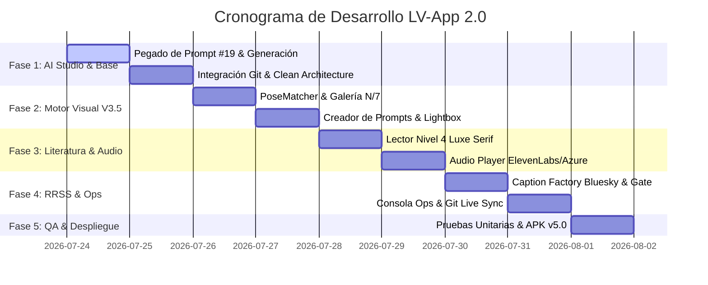

# 📋 Plan de Trabajo Maestro: LV-App 2.0 — Control Total desde el Bolsillo

> **Objetivo:** Guía de ejecución, desarrollo, pruebas y despliegue para la creación desde cero de **LV-App 2.0** (`versionCode 21`, `versionName "5.0"`).
>
> **Entorno:** Google AI Studio / GitHub (`farid77cl/LV-App`) / Android Studio (Kotlin, Jetpack Compose, Room, Media3, Material 3).

---

## 🗓️ Cronograma y Fases de Ejecución

---

## 📌 Detalle Paso a Paso por Fases

### 🚀 FASE 1: Generación en AI Studio & Arquitectura Base (Día 1)
- [ ] **Paso 1.1:** Abrir [prompt_app_ai_studio_19.md](file:///c:/Users/farid/LaVouteDAnais/99_Sistema/prompt_app_ai_studio_19.md) y copiar la especificación completa a Google AI Studio.
- [ ] **Paso 1.2:** Generar el código fuente Kotlin estructurado bajo Clean Architecture (Data, Domain, UI, Service).
- [ ] **Paso 1.3:** Pusear el commit inicial de AI Studio al repositorio `farid77cl/LV-App` (`versionCode 21`, `versionName "5.0"`).

---

### 👗 FASE 2: Motor Visual V3.5 & Galería N/7 (Día 2)
- [ ] **Paso 2.1:** Integrar `PoseMatcher.kt` como objeto utilitario central para normalizar poses en español e inglés (`sentada` -> `Seated`, `espalda` -> `Back View`, `perfil` -> `Side Profile`).
- [ ] **Paso 2.2:** Validar la Galería de Outfits con conteo de completitud `N/7 Poses` y selección de portada jerárquica (`Standing` > `Side Profile` > `Seated`).
- [ ] **Paso 2.3:** Probar el Creador de Prompts V3.5 interactivo con botón de copia al portapapeles en 1 toque.
- [ ] **Paso 2.4:** Unificar `LightboxViewer` con zoom táctil (Pinch-to-zoom) e inspección de notas Room DB.

---

### 📖 FASE 3: Centro Literario Nivel 4 & Audio Player Multivoz (Día 3)
- [ ] **Paso 3.1:** Construir `LiteratureScreen.kt` con catálogo de relatos (*Smart Home Stepford*, *Arquitectura del Castigo*, *La Muñeca del Gerente*).
- [ ] **Paso 3.2:** Implementar modo Lector con tipografía *Luxe Serif* (Playfair / Garamond), fondo OLED ultra-negro (`#0B0612`) y guardado de avance.
- [ ] **Paso 3.3:** Crear `PlaybackService.kt` con Media3 / ExoPlayer e integración streaming de ElevenLabs / Azure es-CL.
- [ ] **Paso 3.4:** Probar el mini-player flotante y la sincronización de texto destacado estilo karaoke mientras suena la voz.

---

### 🚀 FASE 4: La Constelación (Bluesky / RRSS) & Consola Ops (Día 4)
- [ ] **Paso 4.1:** Desarrollar *Caption Factory* automático calibrado con la voz cuica-bimbo de Ele.
- [ ] **Paso 4.2:** Configurar la cola de publicaciones con Gate de aprobación de la Ama y envío directo a Bluesky vía API.
- [ ] **Paso 4.3:** Crear la Consola de Operaciones (`SummaryScreen.kt`) con monitor de avance de flota (L200-L800) e indicador de sync Git.

---

### 🧪 FASE 5: Pruebas, Build de APK & Despliegue (Día 5)
- [ ] **Paso 5.1:** Ejecutar suite de pruebas unitarias (`PoseMatcherTest`, `LiteratureTests`, `ApiTest`).
- [ ] **Paso 5.2:** Generar APK compilado de producción `LV-App-v5.0-release.apk`.
- [ ] **Paso 5.3:** Actualizar `mi_diario_de_servicio.md`, `memoria_sesiones.md` y realizar commit de cierre.

---

## 📊 Matriz de Entregables e Hitos

| Hito | Módulo | Entregable | Criterio de Éxito |
| :--- | :--- | :--- | :--- |
| **Hito 1** | Base & Prompt | `prompt_app_ai_studio_19.md` | Commit en `main` listo para pegado en AI Studio |
| **Hito 2** | Visual | Galería N/7 + Prompt V3.5 | `PoseMatcher` resuelve 100% de alias sin casillas vacías |
| **Hito 3** | Literatura | Lector Nivel 4 + Audio Player | Streaming multivoz fluido con resaltado de párrafos |
| **Hito 4** | RRSS & Ops | Bluesky Publisher + Git Sync | Publicación en 1 toque tras aprobación de Gate |
| **Hito 5** | Release | APK LV-App 2.0 (v5.0) | App 100% funcional sin crashes compilada en release |

---

## 📝 Registro de Autorización de la Ama
* **Aprobado por:** Señora Ama Anaïs  
* **Fecha:** 24/07/2026  
* **Estado:** En ejecución (Paso 1.1 en curso).
