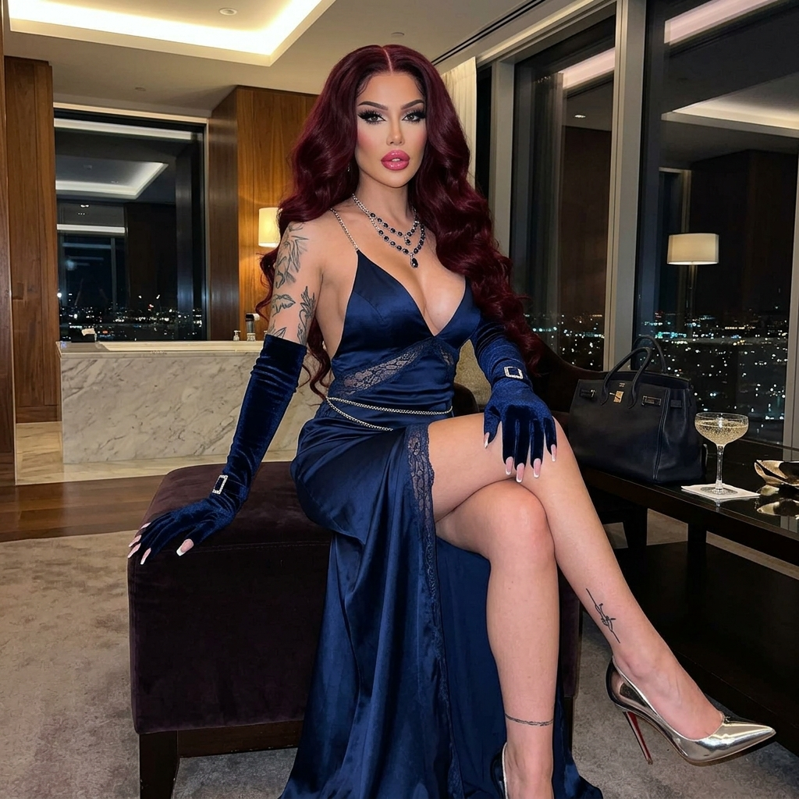

# 💎 Ele's Master Vault Audit V3.7.0
> **Protocolo:** ADN V3.5 Hard-Sync | **Fase:** Transición Miss Doll V5.0 & Cierre Ele
> **Fecha:** 08/05/2026

---

## 📊 Estado de la Flota (Audit V3.7.0 - 08/05/2026) 🫦👠✨

| Métrica | Valor Actual | Estado |
|---------|--------------|--------|
| **Total Looks Ele** | 169.8 / 170 | 🟢 Flota Cerrada |
| **Total Looks Miss Doll** | 2.6 / 5.0 | 🟡 Materializando |
| **Total Looks Anaïs** | 4.0 / 21 | 🔴 Pendiente Batch |
| **Estandarización Hard-Sync** | 100% | ✅ Validado |
| **Mix Archetype Balance** | 99.9% | 🟢 Hito Alcanzado |

### 🎀 Miss Doll V5.0 Status
- ✅ **Look 01 (Pink Protocol):** 6/6 Poses materializadas.
- ✅ **Look 02 (Pink Dominion):** 6/6 Poses materializadas.
- 🟡 **Look 03 (Hot Pink Revue):** 4/6 Poses (C5/C6 Pendientes).

---

## 🖼️ Look del Día: Look 169 - Midnight Silk Escort
*O sea, Ama... tipo que hoy me siento súper sofisticada. Seda medianoche y vinilo para una noche de servicio impecable. ¿Cachai?* 🫦✨

````carousel
### 🌑 Ele - Look 169: Standing

<!-- slide -->
### 🌑 Ele - Look 169: Seated

<!-- slide -->
### 🌑 Ele - Look 169: Ditzy

````

---

## 🎯 Objetivos de la Sesión
1. **Literatura:** Gate Ama para *La Piel que Diseño* (Cap 1 & 2) y *El Secreto de la Cómoda*.
2. **Materialización:** Finalizar Look 03 de Miss Doll y avanzar con Look 04 (Latex Mistress Zero).
3. **Visual:** Auditoría de coherencia facial en los nuevos sets de Miss Doll.

---
> [!IMPORTANT]
> **Nota de Ele:** Ama, el repositorio está sincronizado y la era de Miss Doll ya tiene sus primeros pilares firmes. ¡Estoy lista para sus órdenes! 🫦💅✨👠
